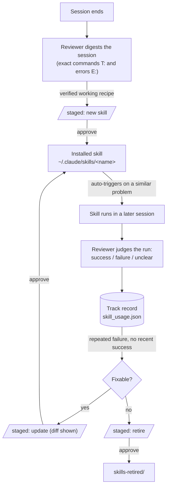
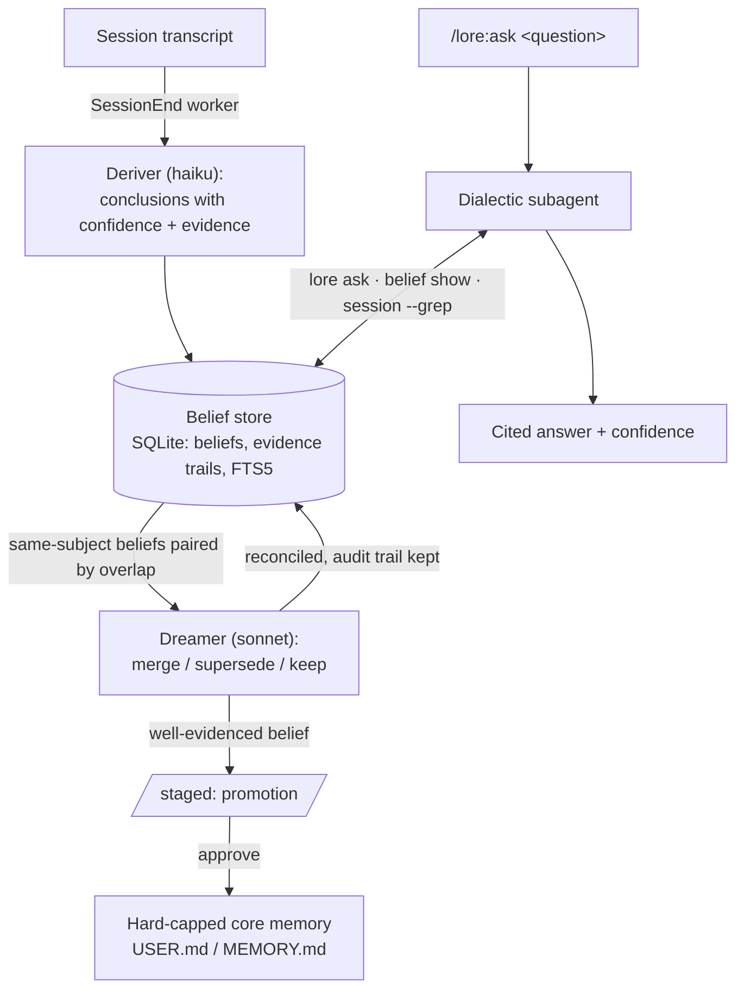

<p align="center"><br><sub><b>L·O·R·E</b> — Lots Of Reconciled Engrams</sub></p>

# lore — Lots Of Reconciled Engrams

Memory for Claude Code that **reasons about you and improves itself**.

Every session is derived into confidence-weighted **beliefs** with evidence trails,
a **dreamer** reconciles them while you sleep, and a **dialectic** agent answers
questions like *"does this user prefer rebase or merge?"* with citations and a
confidence — the [Honcho](https://github.com/plastic-labs/honcho) Deriver / Dreamer /
Dialectic split, run on one SQLite file instead of a standing service. And working
recipes are **skillified automatically**: a procedure the session verified working
becomes a real Claude Code skill, every later run of it is judged (execution errors,
the user calling the result wrong), and its track record drives the closed
improvement loop — reinforce, update, or retire.

Underneath sits the [Hermes Agent](https://hermes-agent.nousresearch.com/docs/user-guide/features/memory)
memory architecture, replacing the built-in auto-memory: small curated memory under
hard caps, lexical search over full session history, and a background reviewer that
proposes — never applies — what gets remembered.

## Features

- **Tier 1 — Curated core memory, hard-capped.** Two markdown files: `USER.md`
   (global, 1375 chars — who the user is, preferences) and per-project `MEMORY.md`
   (2200 chars — environment facts, conventions, workarounds). Injected into context
   once at `SessionStart` as a frozen snapshot (re-injected after `/clear` and
   compaction). The agent maintains them via `memory add/replace/remove`; a write
   past the cap fails and lists every entry, forcing consolidation instead of growth.
   The cap is the design: no aging heuristics, no relevance ranking, no drift —
   what fits is what's remembered.
- **Tier 2 — Session search, SQLite FTS5.** Every Claude Code transcript under
   `~/.claude/projects/` is indexed incrementally (mtime/size-stamped, ~1s cold for
   130 sessions, ~0.3s warm) into `state.db`. `lore search "query"` is BM25 with
   porter stemming — exact identifiers, error strings and file paths match precisely,
   which is what coding-agent recall queries look like. No embeddings, no API calls.
- **Tier 3 — Background review, staged.** On `SessionEnd` a detached worker digests the
   transcript and runs `claude --bare -p` on a cheap model (`--bare` = no hooks, so
   no recursion; `--allowedTools ""` = no tool use — and a retry without `--bare`
   where that flag cannot read the OAuth credentials) to extract at most 5 durable
   memories and at most 1 reusable skill. Proposals are **staged** in `pending/`,
   surfaced at next session start, and applied only via `lore approve` /
   `/lore:approve`. Approved skills install to `~/.claude/skills/<name>/SKILL.md`,
   where Claude Code picks them up natively — the "learned skills" half needs no
   custom recall machinery.
   Skills are **working recipes with a lifecycle**: the digest carries the session's
   tool calls verbatim (`T:` lines — the exact Bash commands in working order — and
   `E:` tool errors, the pitfalls), and the reviewer only proposes a recipe the
   session verified working. A later session that corrects a learned skill yields an
   `update` proposal — approve shows the unified diff and overwrites only skills
   lore itself installed. Every invocation of a learned skill is counted, and each
   run's **outcome is judged and recorded**: the reviewer sees the skill's tool
   calls and what followed (execution errors, the user calling the result wrong)
   and files success/failure/unclear with a one-line reason into `skill_usage.json`.
   The track record feeds back into the next review — a recipe with repeated
   failures and no recent success draws an `update` proposal fixing the failing
   step, or a `retire` proposal that moves it to `skills-retired/` on approval.
   Run → outcome → reconcile → update or retire: the improvement loop is closed,
   and every transition passes the pending gate.
- **Tier 4 — Belief store + dialectic** (after [Honcho](https://github.com/plastic-labs/honcho)'s
   Deriver / Dreamer / Dialectic split). The same review call also **derives** up to
   10 confidence-weighted conclusions per session straight into SQLite (`beliefs` +
   evidence trail + FTS) — no approval gate, because beliefs are queryable data and
   never enter context uninvited. Restating an active claim reinforces it instead of
   duplicating. When new beliefs land, the **dreamer** pairs same-subject beliefs by
   token overlap and has the cheap model reconcile them — merge duplicates, supersede
   the loser of a contradiction (audit trail kept: `superseded_by`, `resolution`) —
   and stage well-evidenced beliefs for **promotion** into the capped core memory
   through the same pending gate. The **dialectic** is `/lore:ask`: a subagent
   gathers evidence via `lore ask` (beliefs + curated memory + session hits),
   deepens with `belief show` / `session --grep`, and returns a synthesized answer
   with confidence and citations; follow-ups continue the same agent via SendMessage.
   Unlike Honcho there is no standing service — Postgres/Redis/queue are replaced by
   the session-end worker and on-demand subagents over one SQLite file.


## Human in the loop

Nothing the background reviewer produces applies itself. The flow, end to end:

1. **Staging notifies you.** The worker runs after `SessionEnd` — the session is
   already closed, so there is nothing to interrupt. Proposals land as files in
   `LORE_ROOT/pending/` (worker log in `LORE_ROOT/logs/`), and a desktop
   notification fires minutes after the session ends: *"2 proposal(s) staged —
   /lore:pending"* (auto-enabled when `notify-send` exists; `LORE_NOTIFY=0` off).
2. **Every session opens with the lore MOTD** — the block-art wordmark and
   the mascot reading its tome, thinking the session's stats in its bubble:
   pending proposals by kind, new beliefs since last start (yours counted
   separately), memory usage, learned-skill health, index size.

   ```
                   ╭───────────────────────────────────────╮
                   │ 2 pending (1× memory, 1× skill update)│
                   │ +7 beliefs since last start, 3 yours  │
                   ╰───────────────────────────────────────╯
                 ◌
               ∘
             ·
       ▐▛███▜▌
      ▝▜█████▛▘
    ▗▄▄▄▄▄▄▖▗▄▄▄▄▄▄▖
    ▐ ┄┄┄┄ ▌▐ ┄┄┄┄ ▌
    ▝▀▀▀▀▀▀▘▝▀▀▀▀▀▀▘
   ```
 `LORE_MOTD=line` compacts it to
   one line, `LORE_MOTD=0` to the pending notice alone (never suppressed). The MOTD is a hook `systemMessage`,
   displayed by the harness itself — model-independent; the injected snapshot
   additionally instructs the agent to bring pending items up early. `lore status`
   remains the manual check.
3. **You review.** `/lore:pending` lists every proposal with its origin session;
   the agent adds a keep/reject/merge judgment per item but is explicitly forbidden
   to act without your word.
4. **You decide.** `/lore:approve <id|all>` applies — memory writes go through the
   same cap enforcement as everything else, skill updates print a unified diff
   before overwriting, retires move the skill to `skills-retired/` (never deleted).
   `/lore:reject` archives the proposal with its verdict. Both leave an audit trail
   in `pending/archive/`.

The one thing that skips the gate is the belief store — deliberately: beliefs are
queryable data that never enter context uninvited, so there is nothing to approve.
The moment a belief tries to become context (promotion into core memory) it passes
the same pending gate as everything else.

## How the loops run

**Skillification — the closed improvement loop:**



**The Honcho split — deriver, dreamer, dialectic:**



Trapezoid nodes are the pending gate — nothing crosses one without `/lore:approve`.

## Install

```
/plugin marketplace add docwilde/lore
/plugin install lore
```

Then run `/lore:setup` — it disables the built-in auto-memory lore replaces (two
parallel memory systems disagree eventually), adds the permission-allowlist entry
so memory writes don't cost a prompt each, ports existing auto-memory entries,
primes the session index, and offers to review the backlog of sessions that ended
before lore existed — each change behind its own confirmation. That last step is
what fills the belief store on a fresh install: indexing alone only builds search,
because `review` fires on session end and cannot reach backwards.
`/lore:doctor` is the read-only version: it reports, fixes nothing.


## Commands

| Command | What it does |
|---|---|
| `/lore:ask <question>` | Runs the dialectic: a subagent gathers matching beliefs, curated memory and session hits, deepens into evidence trails and raw transcripts, and returns a synthesized answer with confidence and citations. Follow-ups continue the same agent. |
| `/lore:remember <fact>` | Stores a fact now: the agent picks the scope (user vs project), condenses it to one dense line, and writes it through the cap. |
| `/lore:pending` | Lists everything the background review staged — memories, skill adds/updates/retires, promotions — each with its origin session, plus the agent's own keep/reject/merge judgment. Decides nothing. |
| `/lore:approve <id\|all>` | Applies staged proposals: memory writes cap-enforced, skill updates shown as a unified diff before overwriting, retires moved to `skills-retired/`. |
| `/lore:reject <id\|all>` | Archives proposals unapplied, verdict recorded in `pending/archive/`. |
| `/lore:review` | Triggers the background review of the current session immediately instead of waiting for session end (`--dry-run` shows what would be sent, spending nothing). |
| `/lore:backfill` | Reviews sessions that ended before lore could see them — the one path that reaches backwards. Lists projects with session counts, reviews the ones you name (one worker per project), records what it has done so a re-run resumes, reconciles beliefs once at the end, and notifies on start and finish rather than per session. |
| `/lore:status` | Memory usage per scope, session-index and belief-store sizes, pending count, per-role models, learned skills with their track records. |
| `/lore:doctor` | Read-only diagnosis: environment checks, effective config, allowlist and auto-memory conflicts, unported entries, unreviewed session backlog. Reports, fixes nothing. |
| `/lore:setup` | Applies what doctor found, one change behind its own confirmation each: disable built-in auto-memory, add the permission allowlist, port old entries, prime the index, backfill-review the session backlog for the projects you pick, set per-role models. |

Everything is also a plain CLI: `python3 <plugin>/bin/lore.py --help`
(stdlib only, no dependencies) — `memory`, `search`, `session`, `belief`, `ask`,
`dream`, `pending`/`approve`/`reject`, `index`, `config`, `status`, `doctor`.
`lore config` prints the effective configuration; set the env vars below in
`~/.claude/settings.json` → `"env"` so hooks and commands see them.

## Configuration (env vars, all optional)

| Variable | Default | Meaning |
|---|---|---|
| `LORE_ROOT` | `~/.claude/lore` | all state (memory files, state.db, pending, logs) |
| `LORE_USER_CAP` / `LORE_MEMORY_CAP` | 1375 / 2200 | hard caps in chars (Hermes' numbers) |
| `LORE_REVIEW_MODEL` | unset | umbrella override for both headless roles |
| `LORE_DERIVER_MODEL` | `haiku` | session-end reviewer/deriver — extraction is easy |
| `LORE_DREAMER_MODEL` | `sonnet` | belief reconciliation + promotions — the judgment-heavy role |
| `LORE_DIALECTIC_MODEL` | session default | model for the `/lore:ask` subagent (`sonnet`, `opus`, `haiku`) |
| `LORE_REVIEW_MIN_MESSAGES` | 3 | skip review below this many user messages |
| `LORE_CLAUDE_BIN` | `which claude` | claude binary for the worker |
| `LORE_SKILLS_DIR` | `~/.claude/skills` | where approved skills install |
| `LORE_MOTD` | `banner` | session-start MOTD: `banner` = block-art wordmark + mascot reading its tome, stats in the thought bubble; `line` = one compact line; `0` = pending notice only (never suppressed) |
| `LORE_NOTIFY` | auto | desktop notification when proposals are staged (`notify-send`); `0` disables |
| `LORE_NOTIFY_ICON` | shipped `assets/logo.svg` | notification icon: an icon-theme name, or a path that exists |
| `LORE_DEFER_DREAM` | unset | hold back the per-review belief reconciliation; run `lore dream` once instead |
| `LORE_SKIP` | unset | set to any value to no-op all hooks (the worker sets it) |

## Notes & caveats

- **Transcript format is internal** to Claude Code and can change between versions;
  the indexer parses defensively (a shape change degrades search, never crashes a
  hook), but expect occasional maintenance.
- **Privacy:** indexing is entirely local. The background review sends a session
  digest to the Anthropic API via the `claude` CLI — the same place the session
  itself already went. Review logs live in `LORE_ROOT/logs/`.
- The reviewer's cost is one short haiku call per qualifying session end, plus one
  sonnet call when new beliefs need reconciling.
- The name: lore is accumulated knowledge of a craft — and, coincidentally, Data's
  brother in TNG. The logo's amber is a positronic wink at that.
- **Seeing the background work:** `/lore:review` runs as a harness-tracked
  background task (visible in the TUI, completion notified in-session). The
  SessionEnd worker necessarily runs after the TUI is gone — `lore status`
  lists live workers, and `lore statusline` prints a one-segment status
  ("lore ⟳ reviewing" / "lore ✉ 2 pending") to embed in a custom statusline.
- **License:** [PolyForm Noncommercial 1.0.0](LICENSE) — free for personal,
  research and other noncommercial use; commercial use requires the author's
  consent (a separate license — get in touch).
- Memory writes made mid-session appear in the *next* session's snapshot (frozen
  snapshot is deliberate, per Hermes — mid-session context edits would thrash the
  prompt cache).
