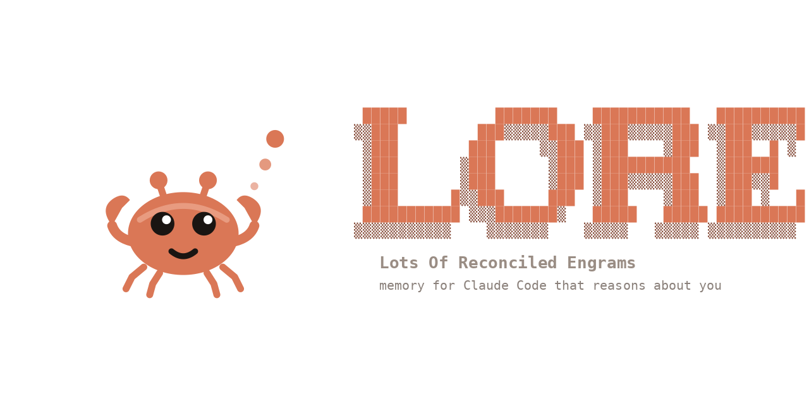
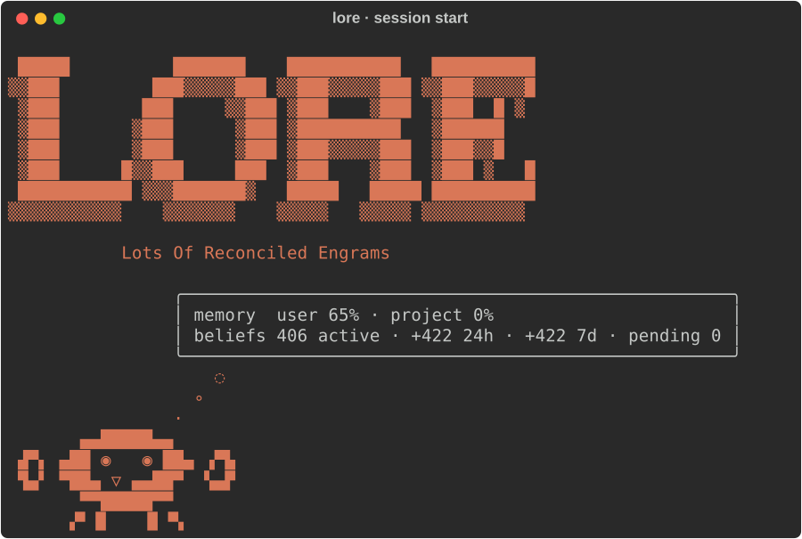
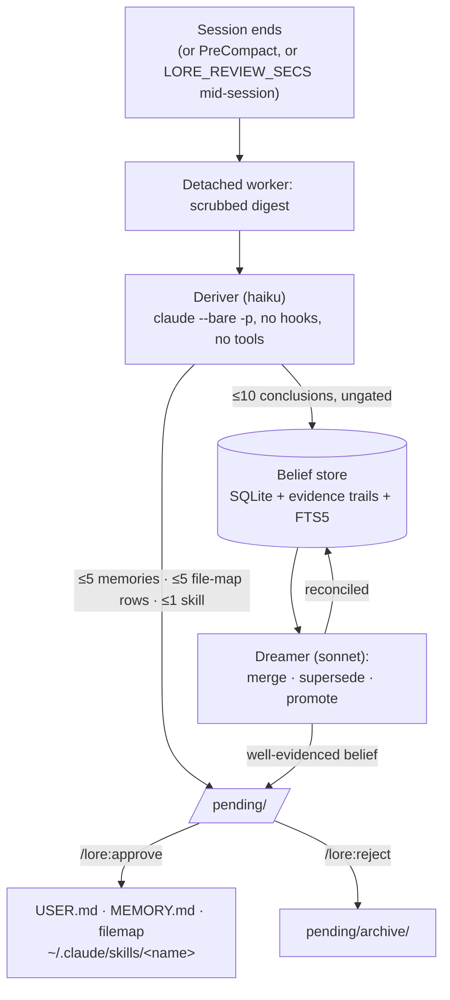
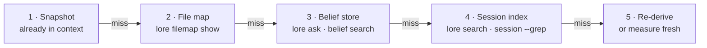

<p align="center"></p>

# LORE — Lots Of Reconciled Engrams

**Persistent memory for Claude Code that nothing writes to without your approval.** Curated memory stays hard-capped and human-directed. A derived belief store keeps everything the agent concluded on its own — and reaches the agent only when you ask for it.

Other agent-memory systems — Mem0, Letta, Zep, [Honcho](https://github.com/plastic-labs/honcho) — compete on recall. LORE bets containment is the scarcer problem: not that the agent remembers more, but that nothing steers it that has not earned the right to.

<p align="center"></p>

## What you get

- **Curated memory behind a cap and a gate.** `USER.md` (2750 chars, global) and `MEMORY.md` (8800 chars, per repo) inject at session start. You write them via `/lore:remember`; background review only *proposes*, and `/lore:approve` applies. A write past the cap fails and lists every entry, forcing consolidation instead of drift. No aging, no relevance ranking.
- **A belief store with evidence trails.** The deriver extracts up to 10 confidence-weighted conclusions per session into SQLite, each carrying its citations. Beliefs never enter context uninvited — read them through `/lore:ask`, or at decision time through `lore consult`.
- **Local full-text session search.** LORE indexes every transcript under `~/.claude/projects/` incrementally into SQLite FTS5. `lore search "query"` runs BM25 with porter stemming, matching identifiers, error strings and paths exactly. No embeddings, no API calls.
- **A project file map.** One `path — purpose` row per load-bearing file, so nobody hunts a location twice. The snapshot carries a one-line pointer, never the map body.
- **Skills that carry a track record.** Review proposes a skill only for a recipe the session verified, judges every later invocation, and proposes an update or a retire once one keeps failing.

## Install

```
/plugin marketplace add docwilde/lore
/plugin install lore
/lore:setup
```

`/lore:setup` walks each `/lore:doctor` finding behind its own confirmation: disable Claude Code's built-in auto-memory (two memory systems disagree eventually), add the permission allowlist so memory writes stop costing a prompt, port existing auto-memory entries, prime the session index, set per-role models.

**First run:** `review` fires at session end and cannot reach backwards, so sessions predating the install stay underived. Run `/lore:backfill project` once to page them through the deriver and fill the belief store.

## Commands

| Command | What it does |
|---|---|
| `/lore:ask <question>` | Dialectic: a subagent gathers beliefs, curated memory and session hits, deepens into evidence trails and transcripts, returns a cited answer with a confidence grade. Follow-ups continue the same agent. |
| `/lore:remember <fact>` | Stores a fact now — picks the scope, condenses to one line, writes through the cap. |
| `/lore:context` | The exact entries in context right now, verbatim, as one table per scope. |
| `/lore:filemap [path "purpose"]` | No args prints the file map; args add or update a row. |
| `/lore:pending` | Lists staged proposals grouped by kind, each with its origin session and a keep/reject/merge judgment. Decides nothing. Clusters piles over ~50. |
| `/lore:approve <id\|all>` | Applies proposals: memory writes cap-enforced, skill updates diffed before overwriting, retires moved to `skills-retired/`. |
| `/lore:reject <id\|all>` | Archives proposals unapplied, verdict recorded in `pending/archive/`. |
| `/lore:review` | Reviews the current session now instead of waiting for session end. Runs as a TUI-visible background task. `--dry-run` prints the prompt and spends nothing. |
| `/lore:backfill [full\|project\|<path>]` | Pages a *whole* transcript through the deriver window by window, not just the newest window. Empty or `full` takes the current session, `project` every transcript of this project, or name a path. Reports the window count before spending. |
| `/lore:status` | Memory fill per scope, index and belief-store sizes, pending count, per-role models, learned skills with their records. |
| `/lore:motd` | Delta view: beliefs added in the last 24h/7d, newest claims verbatim, pending count. |
| `/lore:doctor` | Read-only diagnosis: environment, effective config, allowlist and auto-memory conflicts, unported entries, unreviewed backlog. Fixes nothing. |
| `/lore:setup` | Applies what doctor found, each change behind its own confirmation. |
| `/lore:config` | Prints the stage table and toggles stages by multi-select; writes `settings.json` → `"env"`. |
| `/lore:help` | One-screen reference card: commands plus the memory model. |

Everything runs as a plain CLI too — `python3 <plugin>/bin/lore.py --help`, stdlib only:

`inject` · `snapshot` · `memory` · `filemap` · `search` · `session` · `index` · `review` · `backfill` · `pending` · `approve` · `reject` · `belief` · `ask` · `outcome` · `audit` · `consult` · `stats` · `dream` · `status` · `motd` · `statusline` · `config` · `doctor` · `teardown` · `reset`

## How it works

### Five stores

| Store | Location | Cap | Gate |
|---|---|---|---|
| User memory | `USER.md` | 2750 chars | write-time |
| Project memory | `MEMORY.md`, one per repo | 8800 chars | write-time |
| File map | `filemap/<slug>.md`, one per repo | 4400 chars | write-time |
| Belief store | `state.db` | none | read-time |
| Session index | `state.db` | none | local search only |

A project means the **git repo root**, so a session started in `repo/viz` shares the repo's memory instead of forking an invisible second scope.

The snapshot injects at `SessionStart`, after `/clear` and compaction, and again whenever its content changes — `UserPromptSubmit` hashes it each prompt and re-sends only on a difference (`LORE_REFRESH_ON_CHANGE=0` opts out). It carries both memory scopes, a one-line file-map pointer, and the top user-model beliefs as a labeled interaction-model section.

### Session end → proposal → approval



The worker runs detached and interrupts nothing. A desktop notification follows, and the next session opens with the pending count. `/lore:pending` shows each proposal with a keep/reject/merge opinion the agent may state but never act on. Both verdicts leave a trail in `pending/archive/`.

Skills close a full loop: the digest carries the session's exact commands and tool errors, so review proposes only recipes the session verified. Review then judges every later invocation against what followed it — success, failure or unclear — and logs the verdict to `skill_usage.json`. Repeated failure with no recent success draws an `update` proposal (1–2 recorded outcomes, depending on whether the repo HEAD moved) or a `retire` (3).

### The belief gate sits on read, not on write

The deriver writes beliefs straight to SQLite. Gating each one would gate data nothing reads yet, so the gate moves to the read side:

- **World beliefs** — projects, systems, environment — reach the agent only on demand: `/lore:ask`, or `lore consult` at act time (opt in with `LORE_CONSULT=1`). Consult splits results into **STEER** (≥3 rows in the outcomes ledger, may shape the decision) and **CITE ONLY** (deriver-claimed — mention, never follow).
- **User-model beliefs** (`subject: user-model`) ride into the snapshot openly, labeled uncalibrated. They shape tone and approach, never authorize an action, and stamp `last_referenced` so the influence stays auditable.

LORE **measures** confidence instead of asserting it: `lore stats` prints per-bucket empirical precision from the outcomes ledger, and shouts UNCALIBRATED below 100 outcomes.

**The cost, plainly.** A belief goes live the moment the deriver writes it; no human sees it first. Beliefs untouched for 45 days drop to dormant (`LORE_BELIEF_DORMANT_DAYS`; confidence ≥0.95 exempt) and two recorded contradictions retire one — but nothing re-verifies a claim that keeps getting referenced. A claim true when written can sit there indefinitely, and `/lore:ask` will cite it. Read the store yourself now and then:

```sh
lore belief list                  # everything active, newest first
lore belief search "rebase"       # FTS over claims and evidence
lore belief show 42               # one belief, its evidence trail, its history
lore belief retract 42            # remove one that has gone stale
lore consult "deploy process"     # STEER if calibrated, else CITE ONLY
lore dream --dry-run              # what the reconciler would merge, spending nothing
```

### Where the agent looks



The snapshot states this order as a rule: never re-measure what steps 2–4 already hold.

## Configuration

Every value below is optional and lives in `~/.claude/settings.json` → `"env"`, where hooks and commands both see it. `lore config set <VAR> <value>` and `lore config unset <VAR>` write that block for you (`LORE_*` only). Hook-read switches apply from a session's next hook fire; a restart refreshes everything.

| Variable | Default | Meaning |
|---|---|---|
| `LORE_ROOT` | `~/.claude/lore` | all state: memory files, `state.db`, pending, logs |
| `LORE_PROJECTS_DIR` | `~/.claude/projects` | where the indexer looks for transcripts |
| `LORE_USER_CAP` / `LORE_MEMORY_CAP` | 2750 / 8800 | curated memory caps, in chars |
| `LORE_FILEMAP_CAP` | 4400 | file-map cap, in chars (~55 rows) |
| `LORE_REVIEW_MODEL` | unset | umbrella override for both headless roles |
| `LORE_DERIVER_MODEL` | `haiku` | extraction — the easy role |
| `LORE_DREAMER_MODEL` | `sonnet` | belief reconciliation and promotions — the judgment-heavy role |
| `LORE_DIALECTIC_MODEL` | session default | model for the `/lore:ask` subagent |
| `LORE_REVIEW_MIN_MESSAGES` | 3 | skip review below this many user messages |
| `LORE_DIGEST_LAST_N` | 500 | newest messages considered for the digest |
| `LORE_DIGEST_TOTAL_CAP` | 250000 | chars kept for the whole digest |
| `LORE_CLAUDE_BIN` | `which claude` | claude binary for the worker |
| `LORE_SKILLS_DIR` | `~/.claude/skills` | where approved skills install |
| `LORE_REFRESH_ON_CHANGE` | `1` | re-inject the snapshot the prompt after its content changes; `0` opts out |
| `LORE_REFRESH_SECS` | unset | optional periodic floor for that refresh (change-detection needs no setting) |
| `LORE_REVIEW_SECS` | unset | mid-session deriver: spawn a detached incremental review at most this often; unset = SessionEnd/PreCompact only |
| `LORE_BELIEF_DORMANT_DAYS` | 45 | beliefs unreferenced this long go dormant (confidence ≥0.95 exempt) |
| `LORE_INCLUDE_DORMANT` | unset | `1` puts dormant beliefs back in every evidence pack |
| `LORE_DEFER_DREAM` | unset | hold back per-review reconciliation; run `lore dream` once instead (set this for batches) |
| `LORE_MOTD` | `banner` | `banner` = wordmark, stats box and crab; `line` = one compact line; `0` = pending notice only (never suppressed) |
| `LORE_MOTD_COLOR` | auto | `1`/`0` forces color on or off; a captured hook stays plain automatically |
| `LORE_NOTIFY` | auto | desktop notification when proposals stage (`notify-send`); `0` disables |
| `LORE_NOTIFY_ICON` | `assets/logo.svg` | icon-theme name, or a path that exists |
| `LORE_AGENT_ID` | `main` | names the deriving agent; lands on proposals as `derived_by` and on every skill outcome |
| `LORE_SCOPE` | `all` | default tier for `snapshot`/`inject`: `user`, `project` or `all` |
| `LORE_STREAM_INDEX` | unset | `1` streams the growing transcript into the index every prompt |
| `LORE_CONSULT` | unset | `1` enables act-time `lore consult` |
| `LORE_DISABLE_INJECT` | unset | snapshot off; manual `lore snapshot`/`inject` keep working |
| `LORE_DISABLE_INDEX` | unset | indexing off; the existing index still serves search |
| `LORE_DISABLE_REVIEW` | unset | SessionEnd + PreCompact review off; explicit `lore review` still runs |
| `LORE_DISABLE_PRECOMPACT` | unset | PreCompact review off on its own; SessionEnd keeps running |
| `LORE_DISABLE_BELIEFS` | unset | belief store off; the deriver prompt drops the conclusions channel, `ask` serves memory + search |
| `LORE_DISABLE_SKILLS` | unset | skillification off; skill proposals drop unstaged with a log line |
| `LORE_SKIP` | unset | any value no-ops every hook — the master off-switch above all stage switches |

A disabled stage exits silently rather than failing, and drops its channel from the deriver prompt entirely — a model told about a channel will fill it.

## Hooks

| Event | Runs | Switch |
|---|---|---|
| `SessionStart` (startup, resume, clear, compact) | `lore inject` — the curated snapshot into context | `LORE_DISABLE_INJECT` |
| `UserPromptSubmit` | `lore refresh` — re-inject on content change, plus the mid-session deriver on `LORE_REVIEW_SECS`; `lore index --live` when `LORE_STREAM_INDEX=1` | `LORE_DISABLE_INJECT` / `LORE_DISABLE_INDEX` |
| `PreCompact` | `lore review` — derive before the summarizer drops the detail | `LORE_DISABLE_PRECOMPACT` (or `LORE_DISABLE_REVIEW`) |
| `SessionEnd` | `lore review` — the detached worker: digest, deriver, staged proposals, dreamer | `LORE_DISABLE_REVIEW` |

## Data & safety

- **Indexing and search never leave the machine.** No embeddings, no API calls, no network.
- **Review sends a digest to the same endpoint the session already used** — the Anthropic API via the `claude` CLI. LORE scrubs likely secrets (API keys, bearer tokens, JWTs, connection strings, PEM blocks) on the way in *and* on the way out, before anything reaches disk or the network. Logs stay in `LORE_ROOT/logs/`.
- **Beliefs stay uncurated and ungated on write.** No human approves one before it exists. This is the system's largest hallucination surface; the read-side gate mitigates it, and does not fix it.
- **`/lore:setup` edits `~/.claude/settings.json`** — auto-memory, the permission allowlist, the `"env"` block — each change behind its own confirmation, shown before it applies. `lore teardown` reverses all of it and exports curated memory back to the built-in format.
- **The transcript format belongs to Claude Code** and can change between versions. The indexer parses defensively: a shape change degrades search, never crashes a hook.
- **Cost:** one haiku call per qualifying session end, plus one sonnet call when beliefs need reconciling.

## DOXA — the native terminal

LORE also powers [DOXA](https://github.com/docwilde/doxa), a standalone agent terminal (Claude Agent SDK + Textual): `lore_core` runs in-process there — same files, same SQLite store, byte-compatible with this plugin. One codebase, two carriers. The plugin brings LORE to Claude Code; DOXA makes the memory model native, with detachable daemon sessions, belief-aware tooling behind the containment gate, and the STEER/CITE split rendered in the UI. Fixes land once and ship in both.

## Lineage

Curated memory follows the [Hermes Agent](https://hermes-agent.nousresearch.com/docs/user-guide/features/memory) pattern: hard caps, a reviewer that proposes but never applies, a snapshot that stays frozen rather than thrashing the prompt cache. The belief layer is [Honcho](https://github.com/plastic-labs/honcho)'s deriver/dreamer/dialectic split, run here on one SQLite file with no standing service.

The name means the accumulated knowledge of a craft — and, coincidentally, Data's brother in TNG. The logo's amber is a positronic wink at that.

## Changelog & license

[CHANGELOG.md](CHANGELOG.md) — one line per release, newest first.

[LORE Noncommercial 1.0](LICENSE), derived from PolyForm-Noncommercial: free for personal, research and noncommercial use. Commercial use needs the author's consent under a separate license.
