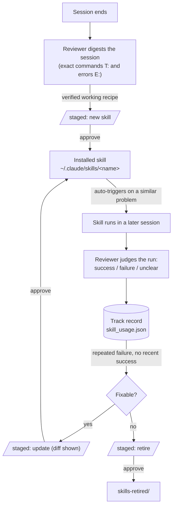
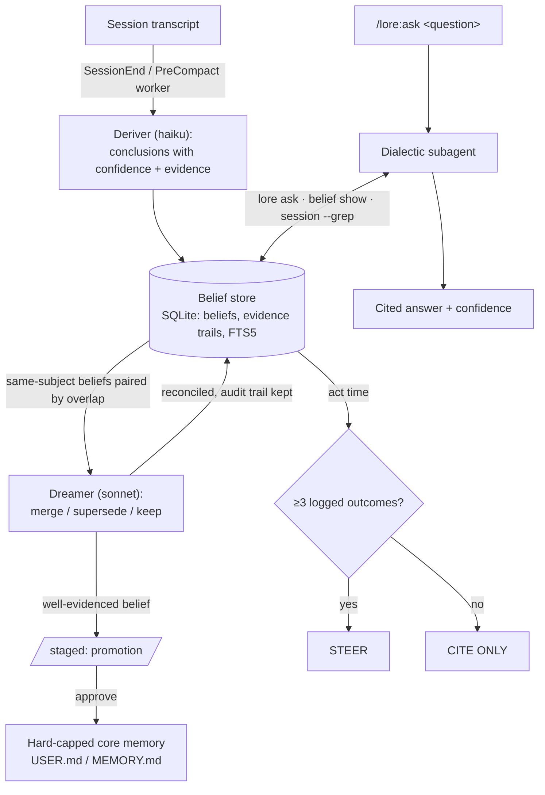

<p align="center"></p>

# LORE — Lots Of Reconciled Engrams

Memory for Claude Code built on one property, not a feature list:
**everything that reaches the agent's behavior is either human-approved or
outcome-calibrated.** Curated memory writes only when a human asks for it
or approves a staged proposal. Skills the same. Beliefs the deriver infers
freely never enter context uninvited — read only on demand, through
`/lore:ask`, or at decision time through `lore consult`: **STEER** for a
calibrated track record, **CITE ONLY** for everything else. The one
labeled exception rides in openly, auditable. Nothing else gets a vote.

The agent-memory space is crowded, and none of it sells this: Mem0, Letta
and Zep compete on recall breadth and a coherent long-term self-model;
Honcho on a clean deriver/dreamer/dialectic split. Not a claim any of them
are wrong — they're solving recall. LORE bets containment is the scarcer
problem: the claim isn't that the agent remembers more, it's that nothing
steers it that hasn't earned the right to.

## Lineage, honestly

Curated memory follows the [Hermes Agent](https://hermes-agent.nousresearch.com/docs/user-guide/features/memory)
pattern — hard caps, a reviewer that proposes but never applies. The
belief layer is [Honcho](https://github.com/plastic-labs/honcho)'s
Deriver/Dreamer/Dialectic split, run here on one SQLite file, no standing
service. Confidence is **measured, not asserted**: `lore stats` prints
per-bucket empirical precision off the outcomes ledger, gated until n≥100
and labeled "anecdote, not a curve" below that.

## Features

- **Tier 1 — Curated core memory, hard-capped, human-directed.** `USER.md`
  (global, 2750 chars — who the user is, preferences) and `MEMORY.md`
  (per-project, 8800 chars — environment, conventions, workarounds) inject
  once at `SessionStart` as a frozen snapshot, re-injected after `/clear`
  and compaction (`LORE_REFRESH_SECS` (periodic floor; change-detection is on by default, `LORE_REFRESH_ON_CHANGE=0` opts out), `LORE_REVIEW_SECS` (mid-session incremental deriver) re-injects mid-session too). The
  agent writes directly via `memory add/replace/remove`
  only when asked — `/lore:remember`, or a manual edit — and a write past
  the cap fails, listing every entry, forcing consolidation. Anything
  background review derives instead is a proposal: staged in `pending/`,
  needing `/lore:approve` before it reaches the file. Either way, a human
  put it there. No aging, no relevance ranking, no drift.
- **Tier 2 — Session search, SQLite FTS5.** LORE indexes every transcript
  under `~/.claude/projects/` incrementally (mtime/size-stamped: ~1s cold
  for 130 sessions, ~0.3s warm) into `state.db`. `lore search "query"` runs
  BM25 with porter stemming, matching identifiers, error strings and file
  paths exactly. No embeddings, no API calls.
- **Tier 3 — Background review, staged.**
  - `SessionEnd` — and `PreCompact`, catching detail the summarizer is
    about to drop — triggers a detached worker: it digests the transcript
    and runs `claude --bare -p` on a cheap model (no hooks, no tool use, no
    recursion), extracting at most 5 memories and 1 skill.
  - Proposals stage in `pending/` and apply only through the same gate as
    memory (see [How trust is earned](#how-trust-is-earned)). Approved
    skills install to `~/.claude/skills/<name>/SKILL.md` — Claude Code
    picks them up natively, no custom recall machinery needed.
  - Skills carry a lifecycle: the digest carries the session's tool calls
    verbatim (`T:` = exact Bash commands in order, `E:` = tool
    errors/pitfalls); the reviewer only proposes recipes the session
    verified working. A later correction yields an `update` proposal;
    approve shows a unified diff and overwrites only LORE-installed skills.
  - Every invocation is judged: the reviewer checks tool calls against
    what followed (errors, the user calling it wrong) and logs
    success/failure/unclear to `skill_usage.json`. Repeated failure with
    no recent success draws an `update` proposal (fixes the failing step)
    or a `retire` proposal (`skills-retired/` on approval). Run → outcome
    → reconcile → update or retire: the loop closes behind the same gate.
- **Tier 4 — Belief store + dialectic, derived freely, gated on read.**
  The `SessionEnd`/`PreCompact` review call **derives** up to 10
  confidence-weighted conclusions per session straight into SQLite
  (`beliefs` + evidence trail + FTS) — no write-time gate, since nothing
  reads a belief yet; restating an active claim reinforces it instead of
  duplicating. Two categories, counted separately in `lore status`:
  **world beliefs** — projects, systems, environment — and **user-model
  beliefs** (`subject: user-model`) — how the user works, decides and
  communicates, grounded in cited behavior, never diagnostic. What each
  is allowed to touch: see [How trust is earned](#how-trust-is-earned).
  The **dreamer** pairs same-subject beliefs by token overlap and has the
  cheap model reconcile them — merge duplicates, supersede the loser of a
  contradiction (`superseded_by`, `resolution` kept), stage well-evidenced
  beliefs for **promotion** into core memory through the same gate. The
  **dialectic** is `/lore:ask`: a subagent gathers evidence via `lore ask`
  (beliefs + curated memory + session hits), deepens with `belief show` /
  `session --grep`, and returns a cited, confidence-scored answer —
  follow-ups continue the same agent.

## How trust is earned

**Memory and skills are gated at write time; beliefs are gated at read
time — two different contracts, same principle.** A proposal is a file in
`LORE_ROOT/pending/` and stays one until you say otherwise:

| | |
|---|---|
| **Staged** | The worker runs after `SessionEnd`; nothing interrupts. Proposals land in `pending/`, the log in `logs/`, and a desktop notification follows minutes later. |
| **Surfaced** | The next session opens with the pending count; the injected snapshot tells the agent to raise it early. `lore status` is the manual check. |
| **Judged** | `/lore:pending` lists every proposal with its origin session. The agent offers a keep/reject/merge opinion but is forbidden to act on it. |
| **Applied** | `/lore:approve <id\|all>` cap-enforces memory writes, diffs skill updates before overwriting, and moves retires to `skills-retired/` instead of deleting them. `/lore:reject` archives with its verdict — both leave a trail in `pending/archive/`. |

**Beliefs skip that gate on the way in — a trade, not an oversight.** The
deriver writes them straight to SQLite; gating each one would gate data
nothing reads yet. The gate moves to the read side.

**Beliefs never steer the agent directly, with one labeled exception.** The
agent's snapshot carries only curated memory plus the top user-model
beliefs, folded in as interaction-model lines that shape tone, never
authorize an action, and stamp `last_referenced` so the influence is
auditable. World beliefs — the bulk of the store — reach the agent only on
demand: via `/lore:ask`, labeled deriver-claimed until the outcomes ledger
calibrates them, or at act time via `lore consult` (stage 7, opt-in via
`LORE_CONSULT=1`) — **STEER** past a calibrated record (≥3 logged
outcomes), **CITE ONLY** otherwise. The belief store is the system's
largest hallucination surface; this is how influence gets earned instead
of asserted.

The cost: a belief is live the moment it's derived, unbounded, and nothing
expires — a claim true when written sits there indefinitely and
`/lore:ask` will cite it. The prompt filters stale claims hard but not
perfectly. Review the store occasionally:

```sh
lore belief list                  # everything active, newest first
lore belief search "rebase"       # FTS over claims and evidence
lore belief show 42               # one belief, its evidence trail, its history
lore belief retract 42            # remove one that has gone stale
lore consult "deploy process"     # STEER if calibrated, else CITE ONLY
lore dream --dry-run              # what the reconciler would merge, spending nothing
```

**A backfill changes the arithmetic, not the rules.** `/lore:backfill`
reviews pre-LORE sessions in one run: a large `pending/` pile per project,
plus a batch of ungated beliefs, both under the same gate. It notifies
twice — total, then results — and reconciles beliefs once at the end.

## What you see at session start

Every session opens with the LORE banner: the block wordmark, a stats box
— memory fill, belief counts and deltas, pending proposals, learned-skill
health — and the crab, its belief trail rising into the box. `/lore:motd`
greets with the same banner on demand and appends the newest claims
verbatim. In a color terminal the wordmark, trail and crab render in
Claude orange.

<p align="center"></p>

`LORE_MOTD=line` compacts it to one line; `LORE_MOTD=0` leaves only the
pending notice, never suppressed. At session start it arrives as a hook
`systemMessage` rendered by the harness — no tokens spent, no dependence
on the model cooperating; color applies only on a real terminal
(`lore motd` in your shell), never in the captured hook output.


## How the loops run

**Skillification — the closed improvement loop:**



**Deriver, dreamer, dialectic, consult — the gate on the way out:**



Trapezoid nodes are the pending gate — nothing crosses one without `/lore:approve`.

## Install

```
/plugin marketplace add docwilde/lore
/plugin install lore
```

Then run `/lore:setup`: it disables the built-in auto-memory LORE replaces
(two memory systems disagree eventually), adds the permission-allowlist
entry so memory writes don't cost a prompt, ports existing auto-memory
entries, primes the session index, and offers to review sessions that
predate LORE — each step behind its own confirmation. That review step
fills the belief store on a fresh install: indexing alone only builds
search, since `review` fires on session end and can't reach backwards.
`/lore:doctor` is the read-only version — reports, fixes nothing.


## Commands

| Command | What it does |
|---|---|
| `/lore:ask <question>` | Dialectic: gathers beliefs, curated memory and session hits, deepens into evidence trails and transcripts, returns a cited, confidence-scored answer. Follow-ups continue the same agent. |
| `/lore:remember <fact>` | Stores a fact now: agent picks the scope (user vs project), condenses to one line, writes through the cap. |
| `/lore:pending` | Everything background review staged — memories, skill adds/updates/retires, promotions — with origin session and the agent's keep/reject/merge judgment. Decides nothing. |
| `/lore:approve <id\|all>` | Applies staged proposals: memory writes cap-enforced, skill updates shown as a unified diff before overwriting, retires moved to `skills-retired/`. |
| `/lore:reject <id\|all>` | Archives proposals unapplied, verdict recorded in `pending/archive/`. |
| `/lore:review` | Triggers background review of the current session now, instead of waiting for session end (`--dry-run`: what would be sent, spending nothing). |
| `/lore:backfill` | Reviews sessions that predate LORE — the one path that reaches backwards. Lists projects with session counts, reviews the ones you name (one worker per project), tracks progress for resumable re-runs, reconciles beliefs once at the end, notifies only on start and finish. |
| `/lore:status` | Memory usage per scope, session-index and belief-store sizes, pending count, per-role models, learned skills with their track records. |
| `/lore:doctor` | Read-only diagnosis: environment checks, effective config, allowlist and auto-memory conflicts, unported entries, unreviewed session backlog. Reports, fixes nothing. |
| `/lore:setup` | Applies what doctor found, each change behind its own confirmation: disable built-in auto-memory, add the permission allowlist, port old entries, prime the index, backfill-review the backlog for the projects you pick, set per-role models. |
| `/lore:motd` | Delta view: beliefs added in the last 24h/7d, newest claims verbatim, pending count — what changed since you last looked. |
| `/lore:config` | Shows the stage table (inject, index, review, beliefs, skills, streaming), toggles stages via multi-select; switches land in `settings.json`'s `"env"` block via `lore config set/unset`. |
| `/lore:help` | One-screen reference card: commands + the memory model. |

Everything is also a plain CLI: `python3 <plugin>/bin/lore.py --help`
(stdlib only, no dependencies) — `memory`, `search`, `session`, `belief`, `ask`,
`dream`, `consult`, `pending`/`approve`/`reject`, `index` (`--live` streams the running session), `config`, `status`, `motd`, `snapshot` (scoped memory block for subagent prompts), `teardown` (full uninstall: exports curated memory back to built-in format), `reset` (`--index|--beliefs|--all`), `doctor`.
`lore config` prints the effective configuration plus a stage table (stage |
switch | on/off). Set the env vars below in `~/.claude/settings.json` →
`"env"` so hooks and commands see them, or let `lore config set <VAR>
<value>` / `lore config unset <VAR>` write that block for you (LORE_\*
variables only; `/lore:config` toggles the stage switches interactively).
Hook-read switches apply from a session's next hook fire; a restart
refreshes everything.

## Hooks

Four Claude Code hook events drive everything automatic; each one exits
silently under its stage switch, and `LORE_SKIP` masters them all:

| Event | Fires | Runs | Switch |
|---|---|---|---|
| `SessionStart` (startup, resume, `/clear`, compact) | once per session (re)start | `lore inject` — the curated memory snapshot into context | `LORE_DISABLE_INJECT` |
| `UserPromptSubmit` | every prompt | `lore refresh` — re-injects the snapshot at most every `LORE_REFRESH_SECS` (periodic floor; change-detection is on by default, `LORE_REFRESH_ON_CHANGE=0` opts out), `LORE_REVIEW_SECS` (mid-session incremental deriver); plus `lore index --live` when `LORE_STREAM_INDEX=1` | `LORE_DISABLE_INJECT` / `LORE_DISABLE_INDEX` |
| `PreCompact` | before the harness summarizes a long session | `lore review` — derives beliefs from the transcript at the moment detail would be lost | `LORE_DISABLE_PRECOMPACT` (or `LORE_DISABLE_REVIEW`) |
| `SessionEnd` | session close | `lore review` — the detached review worker: digest, deriver, staged proposals, dreamer | `LORE_DISABLE_REVIEW` |

## Configuration (env vars, all optional)

Each tier is an independent switch. The five `LORE_DISABLE_*` rows are the
kill switches, all default unset; `LORE_SKIP` sits above all of them.

| Variable | Default | Meaning |
|---|---|---|
| `LORE_ROOT` | `~/.claude/lore` | all state (memory files, state.db, pending, logs) |
| `LORE_USER_CAP` / `LORE_MEMORY_CAP` | 2750 / 8800 | hard caps in chars |
| `LORE_REVIEW_MODEL` | unset | umbrella override for both headless roles |
| `LORE_DERIVER_MODEL` | `haiku` | session-end reviewer/deriver — extraction is easy |
| `LORE_DREAMER_MODEL` | `sonnet` | belief reconciliation + promotions — the judgment-heavy role |
| `LORE_DIALECTIC_MODEL` | session default | model for the `/lore:ask` subagent (`sonnet`, `opus`, `haiku`) |
| `LORE_REVIEW_MIN_MESSAGES` | 3 | skip review below this many user messages |
| `LORE_CLAUDE_BIN` | `which claude` | claude binary for the worker |
| `LORE_SKILLS_DIR` | `~/.claude/skills` | where approved skills install |
| `LORE_MOTD` | `banner` | session-start MOTD: `banner` = block-art wordmark + mascot with stats in its thought bubble; `line` = one compact line; `0` = pending notice only (never suppressed) |
| `LORE_NOTIFY` | auto | desktop notification when proposals are staged (`notify-send`); `0` disables |
| `LORE_NOTIFY_ICON` | shipped `assets/logo.svg` | notification icon: an icon-theme name, or a path that exists |
| `LORE_DEFER_DREAM` | unset | hold back the per-review belief reconciliation; run `lore dream` once instead |
| `LORE_AGENT_ID` | `main` | names the deriving agent; staged proposals carry it as `derived_by`, skill outcomes record it, `lore pending` shows `[by <agent>]` (the `--full` backfill stamps each window `backfill-w<k>`) |
| `LORE_SCOPE` | `all` | default tier for `snapshot`/`inject` when `--scope` is not given: `user`, `project` or `all` |
| `LORE_STREAM_INDEX` | unset | `1` streams the growing transcript into the session index on every prompt (`lore index --live` via the UserPromptSubmit hook; new complete lines only, off by default) |
| `LORE_CONSULT` | unset | `1` enables act-time `lore consult` (stage 7): STEER only past 3 logged outcomes, CITE ONLY below that |
| `LORE_DISABLE_INJECT` | unset | SessionStart/refresh memory snapshot off — hooks exit silently; manual `lore snapshot`/`inject` keep working |
| `LORE_DISABLE_INDEX` | unset | session indexing off — the `--live` hook and opportunistic reindex in `search`/`ask` no-op (existing index still serves); explicit `lore index` still runs, with a notice |
| `LORE_DISABLE_REVIEW` | unset | SessionEnd + PreCompact review off — the hooks exit silently; explicit `lore review` still runs, with a notice |
| `LORE_DISABLE_PRECOMPACT` | unset | PreCompact review off on its own — SessionEnd review keeps running |
| `LORE_DISABLE_BELIEFS` | unset | belief store off — the deriver prompt drops the conclusions channel, the dreamer exits with a notice, `ask` warns and serves memory + session search only |
| `LORE_DISABLE_SKILLS` | unset | skillification off — the deriver prompt drops the skills/skill_outcomes channels, skill proposals are dropped unstaged with a log line |
| `LORE_SKIP` | unset | set to any value to no-op all hooks (the worker sets it) — the master off-switch above every stage switch |

## Notes & caveats

- **Transcript format is internal** to Claude Code and can change between
  versions; the indexer parses defensively (a shape change degrades
  search, never crashes a hook) but expect occasional maintenance.
- **Privacy:** indexing is entirely local. Text is scrubbed for likely
  secrets at ingestion, before it's written anywhere. Background review
  sends the scrubbed digest to the Anthropic API via the `claude` CLI —
  the same place the session already went. Logs live in `LORE_ROOT/logs/`.
- Reviewer cost: one haiku call per qualifying session end, plus one
  sonnet call when beliefs need reconciling.
- The name: accumulated knowledge of a craft, and, coincidentally, Data's
  brother in TNG — the logo's amber is a positronic wink at that.
- **Seeing the background work:** `/lore:review` runs as a harness-tracked
  background task (visible in the TUI, completion notified in-session).
  The SessionEnd worker runs after the TUI is gone, so `lore status` lists
  live workers and `lore statusline` prints a one-segment status ("LORE ⟳
  reviewing" / "LORE ✉ 2 pending") for a custom statusline.
- **License:** [LORE Noncommercial 1.0](LICENSE) (PolyForm-Noncommercial-derived) — free for
  personal, research and noncommercial use; commercial use needs the
  author's consent via a separate license.
- Mid-session memory writes appear in the *next* session's snapshot — the
  frozen snapshot is deliberate (per Hermes: mid-session edits would
  thrash the prompt cache).

## Changelog

See [CHANGELOG.md](CHANGELOG.md) — one line per release, newest first.
