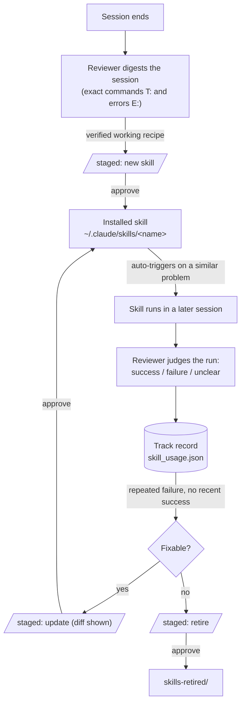
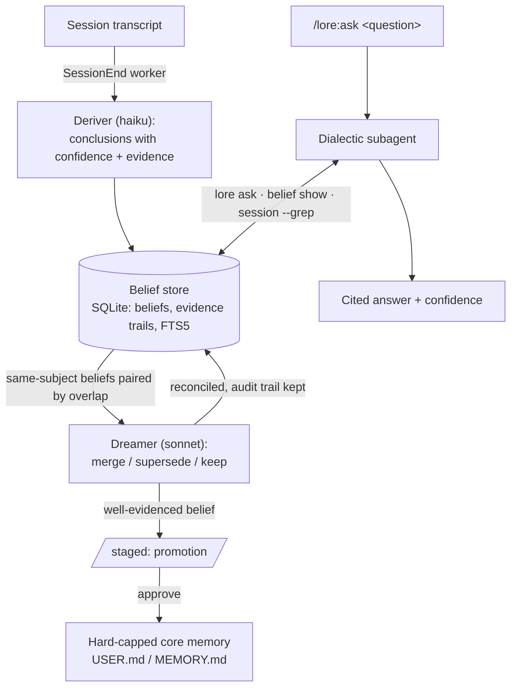

<p align="center"></p>

# LORE — Lots Of Reconciled Engrams

Memory for Claude Code that **reasons about you and improves itself**.

Sessions are derived into confidence-weighted **beliefs** with evidence trails; a
**dreamer** reconciles them in the background; a **dialectic** agent answers
questions like *"does this user prefer rebase or merge?"* with citations and an
honestly-labeled confidence — the [Honcho](https://github.com/plastic-labs/honcho)
Deriver / Dreamer / Dialectic split on one SQLite file, no standing service.
Working procedures are **skillified**: a fumbled-then-fixed command trail becomes a
real Claude Code skill, every later run is judged, and the track record drives
update-or-retire — every transition through a human-approved pending gate.

Underneath sits the [Hermes Agent](https://hermes-agent.nousresearch.com/docs/user-guide/features/memory)
pattern: small curated memory under hard caps, lexical search over full session
history, and a reviewer that proposes — never applies.

## Features

- **Tier 1 — Curated core memory, hard-capped.** Two markdown files: `USER.md`
   (global, 2750 chars — who the user is, preferences) and per-project `MEMORY.md`
   (4400 chars — environment facts, conventions, workarounds). Injected into context
   once at `SessionStart` as a frozen snapshot (re-injected after `/clear` and
   compaction; set `LORE_REFRESH_SECS` to also re-inject mid-session, so memory
   curated now is in context now). The agent maintains them via `memory add/replace/remove`; a write
   past the cap fails and lists every entry, forcing consolidation instead of growth.
   The cap is the design: no aging heuristics, no relevance ranking, no drift —
   what fits is what's remembered.
- **Tier 2 — Session search, SQLite FTS5.** Every Claude Code transcript under
   `~/.claude/projects/` is indexed incrementally (mtime/size-stamped, ~1s cold for
   130 sessions, ~0.3s warm) into `state.db`. `lore search "query"` is BM25 with
   porter stemming — exact identifiers, error strings and file paths match precisely,
   which is what coding-agent recall queries look like. No embeddings, no API calls.
- **Tier 3 — Background review, staged.** On `SessionEnd` a detached worker digests the
   transcript and runs `claude --bare -p` on a cheap model (`--bare` = no hooks, so
   no recursion; `--allowedTools ""` = no tool use — and a retry without `--bare`
   where that flag cannot read the OAuth credentials) to extract at most 5 durable
   memories and at most 1 reusable skill. Proposals are **staged** in `pending/`,
   surfaced at next session start, and applied only via `lore approve` /
   `/lore:approve`. Approved skills install to `~/.claude/skills/<name>/SKILL.md`,
   where Claude Code picks them up natively — the "learned skills" half needs no
   custom recall machinery.
   Skills are **working recipes with a lifecycle**: the digest carries the session's
   tool calls verbatim (`T:` lines — the exact Bash commands in working order — and
   `E:` tool errors, the pitfalls), and the reviewer only proposes a recipe the
   session verified working. A later session that corrects a learned skill yields an
   `update` proposal — approve shows the unified diff and overwrites only skills
   LORE itself installed. Every invocation of a learned skill is counted, and each
   run's **outcome is judged and recorded**: the reviewer sees the skill's tool
   calls and what followed (execution errors, the user calling the result wrong)
   and files success/failure/unclear with a one-line reason into `skill_usage.json`.
   The track record feeds back into the next review — a recipe with repeated
   failures and no recent success draws an `update` proposal fixing the failing
   step, or a `retire` proposal that moves it to `skills-retired/` on approval.
   Run → outcome → reconcile → update or retire: the improvement loop is closed,
   and every transition passes the pending gate.
- **Tier 4 — Belief store + dialectic** (after [Honcho](https://github.com/plastic-labs/honcho)'s
   Deriver / Dreamer / Dialectic split). The same review call also **derives** up to
   10 confidence-weighted conclusions per session straight into SQLite (`beliefs` +
   evidence trail + FTS) — no approval gate, because beliefs are queryable data and
   never enter context uninvited ([what that costs](#human-in-the-loop), and how to
   review the store). Restating an active claim reinforces it instead of duplicating. When new beliefs land, the **dreamer** pairs same-subject beliefs by
   token overlap and has the cheap model reconcile them — merge duplicates, supersede
   the loser of a contradiction (audit trail kept: `superseded_by`, `resolution`) —
   and stage well-evidenced beliefs for **promotion** into the capped core memory
   through the same pending gate. The **dialectic** is `/lore:ask`: a subagent
   gathers evidence via `lore ask` (beliefs + curated memory + session hits),
   deepens with `belief show` / `session --grep`, and returns a synthesized answer
   with confidence and citations; follow-ups continue the same agent via SendMessage.
   Unlike Honcho there is no standing service — Postgres/Redis/queue are replaced by
   the session-end worker and on-demand subagents over one SQLite file.


## Human in the loop

Two stores, two different contracts. Knowing which is which is the whole of it.

**Memory and skills are gated. Nothing applies itself.** A proposal is a file in
`LORE_ROOT/pending/` and stays one until you say otherwise:

| | |
|---|---|
| **Staged** | The worker runs after `SessionEnd`, so there is nothing to interrupt. Proposals land in `pending/`, the worker log in `logs/`, and a desktop notification fires minutes later. |
| **Surfaced** | The next session opens with the pending count, and the injected snapshot tells the agent to raise it early. `lore status` is the manual check. |
| **Judged** | `/lore:pending` lists every proposal with its origin session. The agent offers a keep/reject/merge opinion and is explicitly forbidden to act on it. |
| **Applied** | `/lore:approve <id\|all>` — memory writes go through the same cap enforcement as any other write, skill updates print a unified diff before overwriting, retires move to `skills-retired/` rather than being deleted. `/lore:reject` archives with its verdict. Both leave the trail in `pending/archive/`. |

**Beliefs are not gated, and that is a trade rather than an oversight.** The
deriver writes them straight to SQLite. The argument for it: a belief never
enters context uninvited — it reaches a model only when `/lore:ask` goes looking,
or when the dreamer proposes promoting it into core memory, and *that* crosses the
same gate as everything else. Approving each one would be a gate on data nothing
reads yet.

The cost is real and worth stating plainly. A belief is live the moment it is
derived, the store is unbounded, and nothing expires on its own — so a claim that
was true when written sits there indefinitely, and `/lore:ask` will cite it. The
prompt works hard to keep stale claims out (a durability test, no work in flight,
no measurement stated as though timeless, no third-party names), and it does not
catch everything. Reviewing the store occasionally is part of running this:

```sh
lore belief list                  # everything active, newest first
lore belief search "rebase"       # FTS over claims and evidence
lore belief show 42               # one belief, its evidence trail, its history
lore belief retract 42            # remove one that has gone stale
lore dream --dry-run              # what the reconciler would merge, spending nothing
```

**A backfill changes the arithmetic, not the rules.** `/lore:backfill` reviews
sessions that ended before LORE existed, so it produces in one run what normally
arrives one session at a time: a large `pending/` pile to triage per project, and
a batch of beliefs that went in ungated. It notifies twice — once with the total
it is about to process, once with what it found — rather than once per session,
and it reconciles beliefs a single time at the end. Scan `belief list` afterwards;
that is the pass the per-session flow gives you for free and a batch does not.

## What you see at session start

Every session opens with the LORE MOTD — the wordmark and the mascot reading its
tome, thinking the session's stats in its bubble: pending proposals by kind, new
beliefs since last start (yours counted separately), memory usage, learned-skill
health, index size.

```
                ╭───────────────────────────────────────╮
                │ 2 pending (1× memory, 1× skill update)│
                │ +7 beliefs since last start, 3 yours  │
                ╰───────────────────────────────────────╯
              ◌
            ∘
          ·
    ▐▛███▜▌
   ▝▜█████▛▘
 ▗▄▄▄▄▄▄▖▗▄▄▄▄▄▄▖
 ▐ ┄┄┄┄ ▌▐ ┄┄┄┄ ▌
 ▝▀▀▀▀▀▀▘▝▀▀▀▀▀▀▘
```

`LORE_MOTD=line` compacts it to one line; `LORE_MOTD=0` leaves only the pending
notice, which is never suppressed. The MOTD is a hook `systemMessage` rendered by
the harness itself, so it costs no tokens and does not depend on the model
cooperating.


## How the loops run

**Skillification — the closed improvement loop:**



**The Honcho split — deriver, dreamer, dialectic:**



Trapezoid nodes are the pending gate — nothing crosses one without `/lore:approve`.

## Install

```
/plugin marketplace add docwilde/lore
/plugin install lore
```

Then run `/lore:setup` — it disables the built-in auto-memory LORE replaces (two
parallel memory systems disagree eventually), adds the permission-allowlist entry
so memory writes don't cost a prompt each, ports existing auto-memory entries,
primes the session index, and offers to review the backlog of sessions that ended
before LORE existed — each change behind its own confirmation. That last step is
what fills the belief store on a fresh install: indexing alone only builds search,
because `review` fires on session end and cannot reach backwards.
`/lore:doctor` is the read-only version: it reports, fixes nothing.


## Commands

| Command | What it does |
|---|---|
| `/lore:ask <question>` | Runs the dialectic: a subagent gathers matching beliefs, curated memory and session hits, deepens into evidence trails and raw transcripts, and returns a synthesized answer with confidence and citations. Follow-ups continue the same agent. |
| `/lore:remember <fact>` | Stores a fact now: the agent picks the scope (user vs project), condenses it to one dense line, and writes it through the cap. |
| `/lore:pending` | Lists everything the background review staged — memories, skill adds/updates/retires, promotions — each with its origin session, plus the agent's own keep/reject/merge judgment. Decides nothing. |
| `/lore:approve <id\|all>` | Applies staged proposals: memory writes cap-enforced, skill updates shown as a unified diff before overwriting, retires moved to `skills-retired/`. |
| `/lore:reject <id\|all>` | Archives proposals unapplied, verdict recorded in `pending/archive/`. |
| `/lore:review` | Triggers the background review of the current session immediately instead of waiting for session end (`--dry-run` shows what would be sent, spending nothing). |
| `/lore:backfill` | Reviews sessions that ended before LORE could see them — the one path that reaches backwards. Lists projects with session counts, reviews the ones you name (one worker per project), records what it has done so a re-run resumes, reconciles beliefs once at the end, and notifies on start and finish rather than per session. |
| `/lore:status` | Memory usage per scope, session-index and belief-store sizes, pending count, per-role models, learned skills with their track records. |
| `/lore:doctor` | Read-only diagnosis: environment checks, effective config, allowlist and auto-memory conflicts, unported entries, unreviewed session backlog. Reports, fixes nothing. |
| `/lore:setup` | Applies what doctor found, one change behind its own confirmation each: disable built-in auto-memory, add the permission allowlist, port old entries, prime the index, backfill-review the session backlog for the projects you pick, set per-role models. |
| `/lore:motd` | Delta view: beliefs added in the last 24h/7d, the newest claims verbatim, pending count — what changed since you last looked. |
| `/lore:config` | Shows the stage table (inject, index, review, beliefs, skills, streaming) and toggles stages via multi-select; the switches land in the `settings.json` `"env"` block through `lore config set/unset`. |
| `/lore:help` | One-screen reference card: commands + the memory model. |

Everything is also a plain CLI: `python3 <plugin>/bin/lore.py --help`
(stdlib only, no dependencies) — `memory`, `search`, `session`, `belief`, `ask`,
`dream`, `pending`/`approve`/`reject`, `index` (`--live` streams the running session), `config`, `status`, `motd`, `snapshot` (scoped memory block for subagent prompts), `teardown` (full uninstall: exports curated memory back to built-in format), `reset` (`--index|--beliefs|--all`), `doctor`.
`lore config` prints the effective configuration plus a stage table
(stage | switch | on/off); set the env vars below in `~/.claude/settings.json`
→ `"env"` so hooks and commands see them — or let
`lore config set <VAR> <value>` / `lore config unset <VAR>` write that block
for you (LORE_\* variables only; `/lore:config` toggles the stage switches
interactively). Hook-read switches apply from the next hook fire of a session
carrying them; a restart refreshes everything.

## Configuration (env vars, all optional)

| Variable | Default | Meaning |
|---|---|---|
| `LORE_ROOT` | `~/.claude/lore` | all state (memory files, state.db, pending, logs) |
| `LORE_USER_CAP` / `LORE_MEMORY_CAP` | 2750 / 4400 | hard caps in chars |
| `LORE_REVIEW_MODEL` | unset | umbrella override for both headless roles |
| `LORE_DERIVER_MODEL` | `haiku` | session-end reviewer/deriver — extraction is easy |
| `LORE_DREAMER_MODEL` | `sonnet` | belief reconciliation + promotions — the judgment-heavy role |
| `LORE_DIALECTIC_MODEL` | session default | model for the `/lore:ask` subagent (`sonnet`, `opus`, `haiku`) |
| `LORE_REVIEW_MIN_MESSAGES` | 3 | skip review below this many user messages |
| `LORE_CLAUDE_BIN` | `which claude` | claude binary for the worker |
| `LORE_SKILLS_DIR` | `~/.claude/skills` | where approved skills install |
| `LORE_MOTD` | `banner` | session-start MOTD: `banner` = block-art wordmark + mascot reading its tome, stats in the thought bubble; `line` = one compact line; `0` = pending notice only (never suppressed) |
| `LORE_NOTIFY` | auto | desktop notification when proposals are staged (`notify-send`); `0` disables |
| `LORE_NOTIFY_ICON` | shipped `assets/logo.svg` | notification icon: an icon-theme name, or a path that exists |
| `LORE_DEFER_DREAM` | unset | hold back the per-review belief reconciliation; run `lore dream` once instead |
| `LORE_AGENT_ID` | `main` | names the deriving agent; staged proposals carry it as `derived_by`, skill outcomes record it, `lore pending` shows `[by <agent>]` (the `--full` backfill stamps each window `backfill-w<k>`) |
| `LORE_SCOPE` | `all` | default tier for `snapshot`/`inject` when `--scope` is not given: `user`, `project` or `all` |
| `LORE_STREAM_INDEX` | unset | `1` streams the growing transcript into the session index on every prompt (`lore index --live` via the UserPromptSubmit hook; new complete lines only, off by default) |
| `LORE_DISABLE_INJECT` | unset | stage kill switch: SessionStart/refresh memory snapshot off — hooks exit silently; manual `lore snapshot`/`inject` keep working |
| `LORE_DISABLE_INDEX` | unset | stage kill switch: session indexing off — the `--live` hook and the opportunistic reindex in `search`/`ask` no-op (the existing index still serves); explicit `lore index` still runs, with a notice |
| `LORE_DISABLE_REVIEW` | unset | stage kill switch: SessionEnd review off — the hook exits silently; explicit `lore review` still runs, with a notice |
| `LORE_DISABLE_BELIEFS` | unset | stage kill switch: belief store off — the deriver prompt drops the conclusions channel, the dreamer exits with a notice, `ask` warns and serves memory + session search only |
| `LORE_DISABLE_SKILLS` | unset | stage kill switch: skillification off — the deriver prompt drops the skills/skill_outcomes channels, skill proposals are dropped unstaged with a log line |
| `LORE_SKIP` | unset | set to any value to no-op all hooks (the worker sets it) — the master off-switch above every stage switch |

## Notes & caveats

- **Transcript format is internal** to Claude Code and can change between versions;
  the indexer parses defensively (a shape change degrades search, never crashes a
  hook), but expect occasional maintenance.
- **Privacy:** indexing is entirely local. The background review sends a session
  digest to the Anthropic API via the `claude` CLI — the same place the session
  itself already went. Review logs live in `LORE_ROOT/logs/`.
- The reviewer's cost is one short haiku call per qualifying session end, plus one
  sonnet call when new beliefs need reconciling.
- The name: LORE is accumulated knowledge of a craft — and, coincidentally, Data's
  brother in TNG. The logo's amber is a positronic wink at that.
- **Seeing the background work:** `/lore:review` runs as a harness-tracked
  background task (visible in the TUI, completion notified in-session). The
  SessionEnd worker necessarily runs after the TUI is gone — `lore status`
  lists live workers, and `lore statusline` prints a one-segment status
  ("LORE ⟳ reviewing" / "LORE ✉ 2 pending") to embed in a custom statusline.
- **License:** [PolyForm Noncommercial 1.0.0](LICENSE) — free for personal,
  research and other noncommercial use; commercial use requires the author's
  consent (a separate license — get in touch).
- Memory writes made mid-session appear in the *next* session's snapshot (frozen
  snapshot is deliberate, per Hermes — mid-session context edits would thrash the
  prompt cache).

## Changelog

See [CHANGELOG.md](CHANGELOG.md) — one line per release, newest first.
