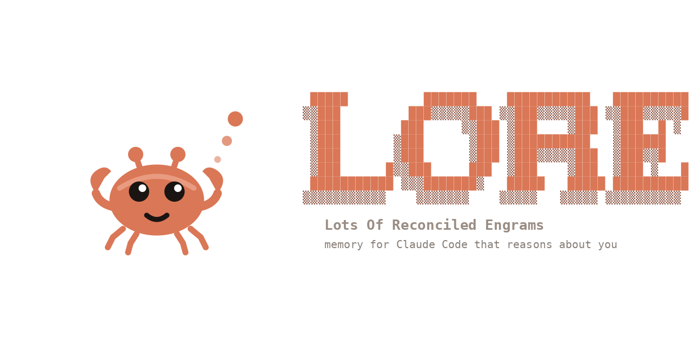
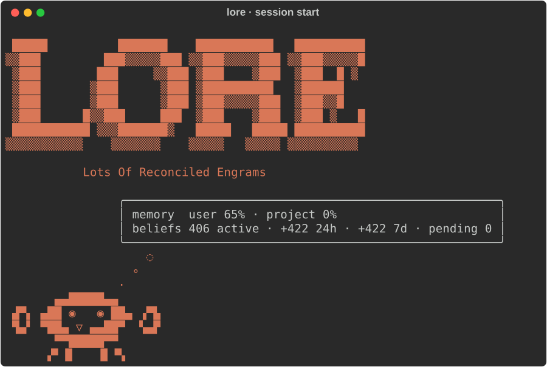

<p align="center"></p>

<p align="center">
  
  <a href="https://github.com/docwilde/LORE/releases"></a>
  
  
  
  
  <a href="LICENSE"></a>
</p>

# LORE — Lots Of Reconciled Engrams

**Persistent memory shared by Claude Code, Codex, and DOXA.** Curated facts
are capped and reviewed. Derived beliefs retain their evidence and appear
on request or through explicitly enabled context.

> [!WARNING]
> **Beta.** Commands, caps, and configuration may change between releases.
> LORE indexes local transcripts; Claude review sends a scrubbed digest to
> the session's Anthropic endpoint. `/lore:setup` edits Claude settings.
> Curated memory requires approval, but the deriver writes beliefs without
> it. Sync is off until configured. Read [Data & safety](#data--safety).

LORE keeps recall separate from authority: a belief carries citations,
and relations between beliefs do not turn them into approved facts.

<p align="center"></p>

## What you get

- **Claude Code, Codex, and DOXA memory.** Share capped, reviewed user and
  project facts across engines; host facts stay local.
- **Beliefs with evidence.** Query conclusions, citations, and their graph on demand.
- **Session search.** Local FTS5 index of Claude Code, DOXA, and Codex transcripts.
- **File maps.** A short `path — purpose` guide to important project files.
- **Learned skills.** Verified recipes are proposed, evaluated, and updated or retired.
- **Cross-machine sync.** Signed hub, peer, or offline transfer; off by default.
- **Agent integration.** Claude Code and Codex plugins inject startup context;
  Claude review and explicit Codex writes retain the proposal and approval gates.

Engine-origin labels add context, not authority. The [manual](docs/manual.md)
explains the write gates, hooks, and belief model.
Use `/lore:filemap` to inspect file maps; `LORE_FILEMAP_CAP` and
`LORE_MACHINE_CAP` bound file maps and machine memory.

## Install

```
/plugin marketplace add docwilde/lore
/plugin install lore
/lore:setup
```

The plugin uses the native Rust CLI. Install Rust with [rustup](https://rustup.rs)
if `lore-rs` is not already installed; the first `/lore:setup` builds it once
in a private disk cache. Hooks use the installed carrier and never build during
startup. From a checkout, use `./task build` or `./task install`.
The carrier may use a newer patch release within the plugin’s major/minor
version; preview versions require an exact match.

Native CLI, hooks, MCP and DOXA share saved caps, stage switches, review
model preferences, context refresh and sync transport settings from
`${CLAUDE_CONFIG_DIR:-$HOME/.claude}/settings.json`. Process environment
overrides saved values, including explicit empty values. A custom store
uses only process overrides unless it belongs to the chosen settings
directory. Store paths and identity remain process configuration. Saved credentials require a private, owned settings file.

`/lore:setup` walks each `/lore:doctor` finding behind its own confirmation: disabling Claude Code's built-in auto-memory, adding the permission allowlist, porting existing entries, priming the session index.

**First run:** review only looks forward, so run `/lore:backfill project` once to derive existing sessions into the belief store.

### Windows

Native Windows is not supported yet. The `bin/lore` launcher and `./task`
require a POSIX shell, and the Rust carrier uses Unix file and process APIs.
CI checks Linux and macOS, but not Windows.

[WSL 2](https://learn.microsoft.com/windows/wsl/install) is the practical
route to try on a Windows machine: install Rust and run LORE and its Claude
Code or Codex integration inside the same Linux
distribution. Keep the checkout and LORE store in the distribution's Linux
filesystem (for example, under `~/`), then follow the install steps above.
This WSL 2 setup has not been verified in LORE CI; see the
[platform notes](docs/manual.md#platform-support) before relying on it.

### Codex

LORE supports Codex through the portable [`plugin.json`](plugin.json) and
its [SessionStart hook](codex/hooks/hooks.json). Installing the full Codex
plugin automatically injects the shared user and current project snapshot
at startup, resume, clear, and compaction. Claude Code, Codex, and DOXA read
the same store; set `LORE_ROOT` when using a store other than `~/.claude/lore`.

The [Codex skill](codex/skills/lore/SKILL.md) supports explicit recall and
memory writes. Index local Codex, Claude Code, and DOXA transcripts with
`lore index`, search them with `lore search "terms" --all`, and read a match
with `lore session <id>`. Indexing and search stay local and use SQLite FTS5.
The Codex startup hook does not index transcripts or run the Claude reviewer.

Use `lore memory add --scope user|project "one concise fact"` for an explicit
write. Detached Codex writes become proposals under the normal write gate;
inspect them with `lore pending` and resolve the exact reviewed proposal in
the native terminal or DOXA. A proposal or search result is not an approved
fact. The plugin manifest declares hooks and interface metadata; the native
`lore mcp` server is available separately and is not registered automatically.

For a skill-only local setup from this checkout:

```sh
mkdir -p "${CODEX_HOME:-$HOME/.codex}/skills"
ln -s "$(pwd)/codex/skills/lore" "${CODEX_HOME:-$HOME/.codex}/skills/lore"
```

The skill calls LORE's CLI against the shared store when a task needs recall.
This skill-only setup does not install the automatic SessionStart hook;
install the full Codex plugin for startup context injection.

## Sync — one memory on every machine

Sync is **off until configured**. LORE records portable changes in a local
operation log; a configured transport moves signed operations between
machines. Failed verification and conflicting writes go to pending review.
Machine memory stays on its own host.

- **Hub:** push and pull through the private `lore-hub` service, which stores operations without interpreting them.
- **Direct peer:** exchange operations between two machines without a hub.
- **Offline bundle:** `lore sync export` and `lore sync import` transfer signed memory, beliefs, file maps, proposals, and skills by file. Bundles exclude transcripts, session indexes, and credentials.

```sh
lore sync status                 # local state; no network call
lore sync login <token>          # hub authentication
lore sync                        # pull, then push
lore sync bootstrap              # initialize a new machine
lore sync export <new-file>      # create an offline bundle
lore sync import <file>          # verify and merge a bundle
lore sync resign --apply         # sign this machine's own backlog with the current key
lore sync seed --apply           # back-fill ops for state older than the log itself
```

Machines must share `LORE_SYNC_HMAC_KEY` to verify operations. You can choose
which data classes sync; see the [manual](docs/manual.md#sync--one-memory-on-every-machine)
for setup and the [protocol](docs/sync-protocol.md) for the wire format.
Signed historical belief operations with missing UID references are kept in
the log as quarantined data and shown by `lore sync status`; they do not enter
curated memory. A fresh direct-peer pull can replay a retained signed log when
an older hub copy cannot be replaced.

## Data & safety

- **Search stays local.** Indexing needs no embeddings or API calls.
- **Claude review uses the session's Anthropic endpoint.** LORE scrubs likely secrets before sending a digest.
- **Derived beliefs are written without approval.** The [read gate](docs/manual.md#the-belief-gate-sits-on-read-not-on-write) limits when they can influence an agent.
- **The write gate is advisory.** `LORE_WRITE_GATE` classifies callers; it is not a security boundary.
- **Sync is opt-in.** Configured transports can carry memory, beliefs, proposals, skills, and selected scrubbed session text; treat the destination as private storage.
- **Setup changes Claude settings with confirmation.** `lore teardown` reverses those changes.

## DOXA — the native terminal

LORE provides a canonical **Rust module** for
[DOXA](https://github.com/docwilde/doxa): memory, beliefs, review, context and
session search share the existing files, SQLite store and signed sync log.
See the [native core guide](docs/native-core.md) for build commands and contracts.
Claude Code and Codex hooks, the standalone CLI, MCP, review and sync transports
use this native core. The Python `lore_core`
[library](docs/manual.md#lore_core-as-a-library) remains a compatibility reference
and interoperability test oracle.

## Reference

- **Manual** — every command, config variable, hook, and store mechanics: [`docs/manual.md`](docs/manual.md)
- **Design rationale** — [`docs/user-model-channel-separation.md`](docs/user-model-channel-separation.md), [`docs/memory-proposal-quality.md`](docs/memory-proposal-quality.md), [`docs/write-gate.md`](docs/write-gate.md)
- **Sync** — the wire contract in [`docs/sync-protocol.md`](docs/sync-protocol.md), the design and merge rules in [`docs/plans/sync.md`](docs/plans/sync.md)
- **[CHANGELOG.md](CHANGELOG.md)** — one line per release, newest first

## Lineage

Curated memory follows the [Hermes Agent](https://hermes-agent.nousresearch.com/docs/user-guide/features/memory) pattern: hard caps, a reviewer that proposes but never applies, a snapshot that stays frozen rather than thrashing the prompt cache. The belief layer is [Honcho](https://github.com/plastic-labs/honcho)'s deriver/dreamer/dialectic split, run here on one SQLite file with no standing service.

The name means the accumulated knowledge of a craft — and, coincidentally, Data's brother in TNG. The logo's amber is a positronic wink at that.

## License

[AGPL-3.0](LICENSE) for everyone, including commercial use. A [commercial license](LICENSE-COMMERCIAL.md) is available where those terms don't fit. "LORE" and its mark are [reserved](TRADEMARK.md).
