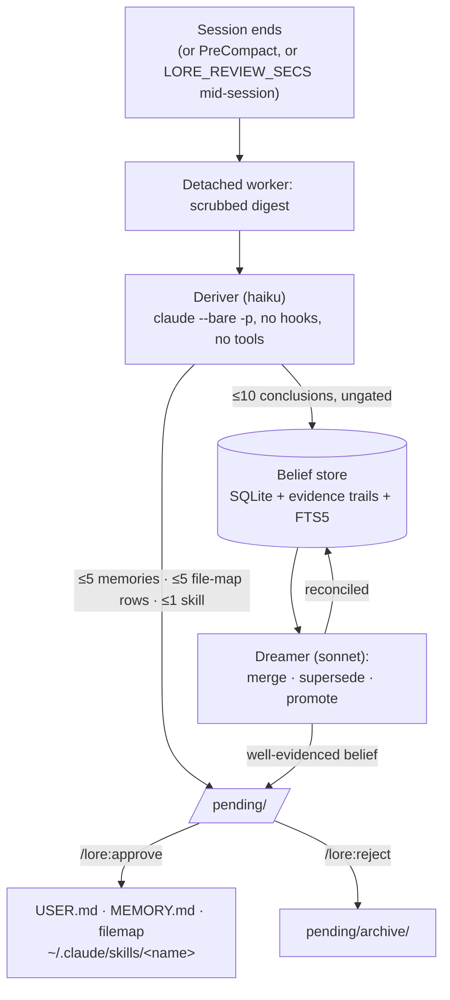
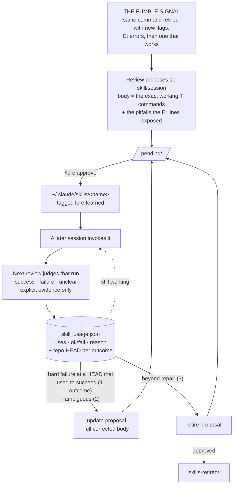
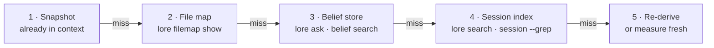

# Manual

Every command, config variable, and hook, plus how the stores and gates
mechanically fit together. This is *what* LORE does; for *why* specific
decisions were made, see [`user-model-channel-separation.md`](user-model-channel-separation.md),
[`memory-proposal-quality.md`](memory-proposal-quality.md), and
[`write-gate.md`](write-gate.md).

## Commands

| Command | What it does |
|---|---|
| `/lore:ask <question>` | Dialectic: a subagent gathers beliefs, curated memory and session hits, deepens into evidence trails and transcripts, returns a cited answer with a confidence grade. Follow-ups continue the same agent. |
| `/lore:remember <fact>` | Stores a fact now — picks the scope, condenses to one line, writes through the cap. |
| `/lore:context` | The exact entries in context right now, verbatim, as one table per scope. |
| `/lore:filemap [path "purpose"]` | No args prints the file map; args add or update a row. |
| `/lore:pending` | Lists staged proposals grouped by kind, each with its origin session and a keep/reject/merge judgment — a staged skill shows its body, truncated, not only its description. Decides nothing. Clusters piles over ~50. |
| `/lore:approve <id\|all>` | Applies proposals: memory writes cap-enforced, every skill install diffed first (a first install against nothing), retires moved to `skills-retired/`. A proposal whose file changed since it was listed is refused and re-shown — approval is consent to a text, not to an id. |
| `/lore:reject <id\|all>` | Archives proposals unapplied, verdict recorded in `pending/archive/`. |
| `/lore:review` | Reviews the current session now instead of waiting for session end. Runs as a TUI-visible background task. `--dry-run` prints the prompt and spends nothing. |
| `/lore:backfill [full\|project\|<path>]` | Pages a *whole* transcript through the deriver window by window, not just the newest window. Empty or `full` takes the current session, `project` every transcript of this project, or name a path. Reports the window count before spending. |
| `/lore:status` | Memory fill per scope, index and belief-store sizes, pending count, per-role models, learned skills with their records. |
| `/lore:motd` | Delta view: beliefs added in the last 24h/7d, newest claims verbatim, pending count. |
| `/lore:doctor` | Read-only diagnosis: environment, effective config, allowlist and auto-memory conflicts, unported entries, unreviewed backlog. Fixes nothing. |
| `/lore:setup` | Applies what doctor found, each change behind its own confirmation. |
| `/lore:config` | Prints the stage table and toggles stages by multi-select; writes `settings.json` → `"env"`. |
| `/lore:help` | One-screen reference card: commands plus the memory model. |

Everything runs as a plain CLI too — `python3 <plugin>/bin/lore.py --help`, stdlib only:

`inject` · `snapshot` · `memory` · `filemap` · `search` · `session` · `index` · `review` · `backfill` · `pending` · `approve` · `reject` · `belief` · `ask` · `outcome` · `audit` · `consult` · `stats` · `dream` · `crosscheck` · `status` · `motd` · `statusline` · `provenance` · `config` · `doctor` · `sync` · `teardown` · `reset`

## Six stores

| Store | Location | Cap | Gate |
|---|---|---|---|
| User memory | `USER.md` | 9000 chars | write-time |
| Project memory | `MEMORY.md`, one per repo | 8800 chars | write-time |
| Machine memory | `machines/<host>.md`, one per host | 4400 chars | write-time |
| File map | `filemap/<slug>.md`, one per repo | 4400 chars | write-time |
| Belief store | `state.db` | none | read-time |
| Session index | `state.db` | none | local search only |

A project means the **git repo root**, so a session started in `repo/viz` shares the repo's memory instead of forking an invisible second scope.

`lore index` and `lore search` read Claude transcripts from `~/.claude/projects` and native Codex transcripts from `${CODEX_HOME:-~/.codex}/sessions`. Both use the same project-scoped FTS5 index. Search hits and `lore session` display the source engine; it is provenance, not a separate memory scope. Codex sessions use ids prefixed with `codex:` in LORE. DOXA's Codex transcripts are already indexed in Claude-shaped form, so their matching native Codex rollouts are skipped when DOXA's thread sidecar is present. Override the native directory with `LORE_CODEX_SESSIONS_DIR`.

- A project-scoped fact defaults to the repo it was learned in. When a session is clearly about a different repo (reviewing another repo's PR, discussing a plugin from its consumer), the reviewer can name that project explicitly; a resolvable name retargets the write and shows as a cross-project note in `/lore:pending`. An unresolvable name stays filed under the session's own project rather than guessing, flagged the same way.
- `lore memory move --scope project --match "<substring>" --to <slug>` relocates an already-mis-scoped entry, cap-enforced on the destination like any other write.

**Machine memory** holds what is true of one *box* rather than of the person or the repo: a driver workaround, a kernel or sandbox capability, a tmpfs size, where a tool happens to be installed. Those used to default into user memory, which is asserted on every machine you work on — so a laptop's Wi-Fi quirk was stated as fact on the workstation, and since 0.55.0 it travelled there too.

- The scope is keyed by **host name**, not by sync's `machine_id`: the subject of a machine fact is a box a human names, including boxes lore has never run on (`--host gpu-box` files a note about one you only ever ssh into).
- **Only the current host's file is injected.** Other hosts cost one pointer line in the snapshot and are read on demand with `lore memory show --scope machine --host <name>` — the same pull-on-demand discipline as the file map. A fleet must not cost context every session.
- **Machine memory does not sync.** The wire encodes a memory op's scope entirely in `project_key` (`null` means user), so a machine op has no correct shape: `null` files a single box's quirk into every machine's `USER.md`, and a resolved key invents a project named after a host. It stays on the store that learned it until the receiver can name the scope. A machine-scoped *proposal* does cross, carrying the host it names, so approving it elsewhere files it under that host and never injects it there.
- **Migration:** `lore memory move --scope user --match "<substring>" --to-machine <host>`. Nothing is reclassified automatically — a sweep guessing which user entries are "about this box" would be a model deleting from your memory unsupervised. The *removal* propagates as a sync op, so the fact stops being asserted on the machines it already reached; the arrival does not, so it lands only where it is true.
- `lore project move <old> <new> [--dry-run]` re-files a whole project identity: beliefs (a verbatim duplicate the destination already holds is superseded by it), evidence, the session index, staged proposals, `MEMORY.md` and the file map. Use it when a checkout moves on disk — its slug is its path, so the old one is dead the moment the directory is. `<old>` may also be a bare belief subject (`finch-releases`), folded into the project it is about. `lore index --force` re-reads transcripts from their original directories and would re-file those sessions under the old slug.

The snapshot injects at `SessionStart`, after `/clear` and compaction, and again whenever its content changes — `UserPromptSubmit` hashes it each prompt and re-sends only on a difference (`LORE_REFRESH_ON_CHANGE=0` opts out). It carries the user and project scopes, this host's machine memory when it has any, a one-line file-map pointer, and the top user-model beliefs as a labeled interaction-model section.

## Session end → proposal → approval



The worker runs detached and interrupts nothing. A desktop notification follows, and the next session opens with the pending count. `/lore:pending` shows each proposal with a keep/reject/merge opinion the agent may state but never act on. Both verdicts leave a trail in `pending/archive/`.

## Skills earn their keep, then lose it

Memory records what happened. Skillification records *how it was done* — and keeps score.



Four rules keep the loop honest:

- **Only verified recipes.** The digest tags every tool call (`T:`) and tool error (`E:`), so review proposes a body built from commands that actually ran green. A plan nobody executed is not a recipe.
- **Runbooks, not one-liners.** Three steps or more, environment-specific flags, ordering constraints. A single-command fix becomes a memory line instead.
- **Silence is not an outcome.** A run counts as success or failure only when the digest shows the result — the user confirmed it, tests passed, an error traced. Abandonment records nothing, so the track record never fills with noise.
- **Drift ≠ rot.** Every outcome carries the repo HEAD it happened at. When a skill starts failing, a HEAD that moved between the successes and the failures says *the codebase changed*, not *the recipe is wrong* — and the gate reads that trail before it proposes anything.

`/lore:status` prints each learned skill with its record. Every install is diffed before it is written — an `update` against the installed file, a first install against nothing, because that is the case where the whole file is about to become instructions a future session runs. Approve a `retire` and it moves to `skills-retired/` rather than vanishing.

## The belief gate sits on read, not on write

The deriver writes beliefs straight to SQLite, ungated. The gate sits on the read side instead:

- **World beliefs** — projects, systems, environment — reach the agent only on demand: `/lore:ask`, or `lore consult` at act time (opt in with `LORE_CONSULT=1`). Consult splits results into **STEER** (≥3 rows in the outcomes ledger, may shape the decision) and **CITE ONLY** (deriver-claimed — mention, never follow).
- **User-model beliefs** (`subject: user-model`) ride into the snapshot openly, labeled uncalibrated. They shape tone and approach, never authorize an action, and stamp `last_referenced` so the influence stays auditable.

**`user` and `user-model` are separate channels.** A preference the user stated goes to `user`, where a later session may act on it; a pattern the reviewer inferred from behaviour goes to `user-model`, which authorizes nothing. A conclusion already covered by the other channel is dropped before it is written. Rationale, the channel rule, and the containment check behind the drop logic: [`user-model-channel-separation.md`](user-model-channel-separation.md). `lore crosscheck` lists cross-channel near-duplicate pairs, read-only, for a human to resolve.

LORE measures confidence instead of asserting it: `lore stats` prints per-bucket empirical precision from the outcomes ledger, and shouts UNCALIBRATED below 100 outcomes.

**The cost, plainly.** A belief goes live the moment the deriver writes it; no human sees it first. Beliefs unreferenced for 45 days go dormant (`LORE_BELIEF_DORMANT_DAYS`; confidence ≥0.95 exempt) and two recorded contradictions retire one — but nothing re-verifies a claim that keeps getting cited. Read the store yourself now and then:

```sh
lore belief list                  # everything active, newest first
lore belief search "rebase"       # FTS over claims and evidence
lore belief show 42               # one belief, its evidence trail, its history
lore belief retract 42            # remove one that has gone stale
lore consult "deploy process"     # STEER if calibrated, else CITE ONLY
lore dream --dry-run              # what the reconciler would merge, spending nothing
lore crosscheck                   # user vs user-model near-duplicates, read-only
```

## The write gate: who is allowed to write directly

Curated memory and beliefs are injected straight into the model's context —
LORE's highest-trust surface. Every CLI write (`memory add|replace|remove|move`,
`belief add|retract`, `filemap add|replace|remove`) is classified by who is
calling. Rationale, the measured classification signals, and the gate's
limits: [`write-gate.md`](write-gate.md).

| Caller | How it is recognised | What happens |
|---|---|---|
| **interactive** — the agent's own Bash tool call | `AI_AGENT=claude-code_<v>_agent` | applies immediately (the intended path) |
| **terminal** — a human in a shell | no Claude Code in the env, stdin is a tty | applies immediately |
| **hook** — a command Claude Code ran as a hook | `AI_AGENT=..._harness`, or `CLAUDE_PROJECT_DIR` set without the agent marker | **stages in `pending/`** |
| **detached** — cron, a daemon, a script | no Claude Code, no tty | **stages in `pending/`** |

A staged write lands in the same `pending/` pile as every reviewer proposal —
applies with `/lore:approve`, archives unapplied with `/lore:reject`.
`/lore:pending` marks these rows with the context that wrote them.

**The gate is advisory** — forgeable via `AI_AGENT=..._agent` or
`LORE_WRITE_GATE=off` — and does not distinguish a skill or a subagent from
the interactive agent, since those carry the same marker. It stops writers
not actively trying to evade it: a plugin's hook, a third-party script, a
cron job.

**Provenance holds regardless.** Every entry records how it got in —
`approved`, `interactive`, `terminal`, `derived`, `dream`, or `unknown` for
anything that predates 0.36.0 — and the snapshot carries the counts per scope:

```
## Project memory (3120/8800 chars (35%)) — my-repo — provenance: 12 approved, 6 interactive, 9 unknown
```

`lore provenance` lists it per entry; beliefs show `via derived` /
`via approved` in `lore belief list|show`.

User memory remains one shared `USER.md`, and each repository has one project
`MEMORY.md`, regardless of which agent wrote a fact. The snapshot adds
`[source: codex]` or `[source: claude]` after a fact when its originating
engine is known; the file and its scope are unchanged. Set `LORE_ENGINE` for
direct integrations, or include `source_engine` in a staged memory item.
The label travels with signed memory sync operations, including manual bundles.
Older facts and operations retain unknown engine provenance.

## Where the agent looks



The snapshot states this order as a rule: never re-measure what steps 2–4 already hold.

## Configuration

Every value below is optional and lives in `~/.claude/settings.json` → `"env"`, where hooks and commands both see it. `lore config set <VAR> <value>` and `lore config unset <VAR>` write that block for you (`LORE_*` only). Hook-read switches apply from a session's next hook fire; a restart refreshes everything.

| Variable | Default | Meaning |
|---|---|---|
| `LORE_ROOT` | `~/.claude/lore` | all state: memory files, `state.db`, pending, logs |
| `LORE_PROJECTS_DIR` | `~/.claude/projects` | where the indexer looks for transcripts |
| `LORE_USER_CAP` / `LORE_MEMORY_CAP` | 9000 / 8800 | curated memory caps, in chars |
| `LORE_CLUSTER_BLOCK` | 0.30 | `pending --cluster` blocking threshold; lower keeps more candidate pairs |
| `LORE_CLUSTER_MODEL` | `haiku` | model that splits blocked clusters into same-fact groups; `off` keeps the lexical grouping |
| `LORE_FILEMAP_CAP` | 4400 | file-map cap, in chars (~55 rows) |
| `LORE_MACHINE_CAP` | 4400 | machine-memory cap, in chars, per host |
| `LORE_MACHINE_HOST` | `hostname` | this host's machine-memory key; override when the hostname is not the name you use |
| `LORE_REVIEW_MODEL` | unset | umbrella override for both headless roles |
| `LORE_DERIVER_MODEL` | `haiku` | extraction — the easy role |
| `LORE_DREAMER_MODEL` | `sonnet` | belief reconciliation and promotions — the judgment-heavy role |
| `LORE_DIALECTIC_MODEL` | session default | model for the `/lore:ask` subagent |
| `LORE_REVIEW_MIN_MESSAGES` | 3 | skip review below this many user messages |
| `LORE_DIGEST_LAST_N` | 500 | newest messages considered for the digest |
| `LORE_DIGEST_TOTAL_CAP` | 250000 | chars kept for the whole digest |
| `LORE_MEMORY_PROPOSAL_CAP` | 3 | memory proposals one review may stage — the ceiling the prompt states *and* staging enforces |
| `LORE_DUP_CONTAINMENT` | 0.60 | drop a proposal whose tokens an existing entry in the same scope already carries by this fraction (a `replace` that matches a live entry is exempt) |
| `LORE_CLAUDE_BIN` | `which claude` | claude binary for the worker |
| `LORE_SKILLS_DIR` | `~/.claude/skills` | where approved skills install |
| `LORE_CODEX_SESSIONS_DIR` | `${CODEX_HOME:-~/.codex}/sessions` | native Codex rollout directory for session search indexing |
| `LORE_REFRESH_ON_CHANGE` | `1` | re-inject the snapshot the prompt after its content changes; `0` opts out |
| `LORE_REFRESH_SECS` | unset | optional periodic floor for that refresh (change-detection needs no setting) |
| `LORE_REVIEW_SECS` | unset | mid-session deriver: spawn a detached incremental review at most this often; unset = SessionEnd/PreCompact only |
| `LORE_BELIEF_DORMANT_DAYS` | 45 | beliefs unreferenced this long go dormant (confidence ≥0.95 exempt) |
| `LORE_INCLUDE_DORMANT` | unset | `1` puts dormant beliefs back in every evidence pack |
| `LORE_DEFER_DREAM` | unset | hold back per-review reconciliation; run `lore dream` once instead (set this for batches) |
| `LORE_MOTD` | `banner` | `banner` = wordmark, stats box and crab; `line` = one compact line; `0` = pending notice only (never suppressed) |
| `LORE_MOTD_COLOR` | auto | `1`/`0` forces color on or off; a captured hook stays plain automatically |
| `LORE_NOTIFY` | auto | desktop notification when proposals stage (`notify-send`); `0` disables |
| `LORE_NOTIFY_ICON` | `assets/logo.svg` | icon-theme name, or a path that exists |
| `LORE_AGENT_ID` | `main` | names the deriving agent; lands on proposals as `derived_by` and on every skill outcome |
| `LORE_SCOPE` | `all` | default tier for `snapshot`/`inject`: `user`, `project` or `all` |
| `LORE_STREAM_INDEX` | unset | `1` streams the growing transcript into the index every prompt |
| `LORE_CONSULT` | unset | `1` enables act-time `lore consult` |
| `LORE_DISABLE_INJECT` | unset | snapshot off; manual `lore snapshot`/`inject` keep working |
| `LORE_DISABLE_INDEX` | unset | indexing off; the existing index still serves search |
| `LORE_DISABLE_REVIEW` | unset | SessionEnd + PreCompact review off; explicit `lore review` still runs |
| `LORE_DISABLE_PRECOMPACT` | unset | PreCompact review off on its own; SessionEnd keeps running |
| `LORE_DISABLE_BELIEFS` | unset | belief store off; the deriver prompt drops the conclusions channel, `ask` serves memory + search |
| `LORE_DISABLE_SKILLS` | unset | skillification off; skill proposals drop unstaged with a log line |
| `LORE_WRITE_GATE` | `on` | `off` lets non-interactive callers write directly again (pre-0.36 behaviour). An escape hatch for your own automation — advisory, not a control: anything able to set it can equally forge the signals the gate reads |
| `LORE_SYNC_URL` | unset | hub base URL; unset means sync is off entirely |
| `LORE_SYNC_TOKEN` | unset | this machine's bearer token — written by `lore sync login` |
| `LORE_SYNC_AUTH` | `token` | `token` (bearer) or `tailscale` (identity header injected by `tailscale serve`) |
| `LORE_SYNC_HMAC_KEY` | unset | shared integrity key, set on every machine of one account, never sent. Stored in `settings.json`, which lore keeps at `0600` |
| `LORE_MACHINE_ID` | persisted uuid4 | this machine's identity in the op log; honoured only at first creation. The hostname is a label, not the id. |
| `LORE_SYNC_CLASSES` | `memory,filemap,beliefs,pending,skills,sessions` | which classes are **sent and applied** — a class left out is neither appended here nor applied from a peer; `transcripts`, `tabsets`, `worktrees`, `skill_usage` are opt-in |
| `LORE_SYNC_TIMEOUT` | 15 | seconds per hub call |
| `LORE_SYNC_PULL_AT_START` | `1` | detached pull at SessionStart; `0` turns it off |
| `LORE_SYNC_PULL_SECS` | 120 | floor between those pulls, so a resume/clear/compact storm does not fan out |
| `LORE_SYNC_PUSH_AFTER_REVIEW` | `1` | push when the review worker finishes; `0` turns it off |
| `LORE_SYNC_PEER` | unset | Transport B: a comma list of tailnet nodes to pull from directly. A bare name (`workstation`) means `http://workstation:<port>`; a full URL is used as written, which is the `tailscale serve` form |
| `LORE_SYNC_PEER_PORT` | 8765 | port `lore sync serve` binds and a bare peer name dials |
| `LORE_SYNC_PEER_AUTH` | `tailscale` | how `lore sync serve` authenticates: the Tailscale identity header, or `none` — which is required, and must be typed, before it will bind anything but loopback |
| `LORE_SYNC_PEER_ALLOW` | unset | comma list of tailnet logins `lore sync serve` will answer; unset means any identity `tailscale serve` vouched for. Not enforced at all under `LORE_SYNC_PEER_AUTH=none`, and the banner says so |
| `LORE_SYNC_PEER_SECRET` | unset | shared string required as `Authorization: Bearer <secret>` on every authenticated request, in addition to the identity header. Set it on the listener and on every machine that pulls from it. Never printed or logged |
| `LORE_SYNC_PEER_LOG` | unset | `1` logs one line per served request to stderr |
| `LORE_DISABLE_SYNC` | unset | stage kill switch: no op is appended and nothing syncs |
| `LORE_SKIP` | unset | any value no-ops every hook — the master off-switch above all stage switches |

A disabled stage exits silently rather than failing, and drops its channel from the deriver prompt entirely — a model told about a channel will fill it.

## Sync — one memory on every machine

Off until `LORE_SYNC_URL` is set. With it set, every write to a synced class appends an op to a local log, and `lore sync` moves those ops through a hub so the laptop, the workstation and a cloud sandbox end up with one memory instead of three. The merge rules live here, in `lore_core`; the hub stores ops and never interprets one.

| Command | What it does |
|---|---|
| `lore sync` | pull, then push |
| `lore sync status` | machine id and label, unpushed count, classes on/off, what is waiting or unverified, conflicts, peer cursors. No network call. |
| `lore sync push` | send this machine's own ops from the peer cursor, page by page. `--from <seq>` re-sends from there instead (`--from 0` re-seeds a hub that lost its data). |
| `lore sync pull` | drain everything past the cursor — from the hub and from every configured peer — sort into canonical order, apply, then advance each cursor. `--peer <name>` pulls from that one peer alone. |
| `lore sync bootstrap` | fill a fresh `LORE_ROOT` from the hub, or from `--peer <name>`. Refuses a populated one and says what is in it; `--merge` proceeds as an ordinary pull. |
| `lore sync serve` | Transport B: serve this machine's op log to a peer. Pull side only, loopback unless told otherwise, and started by nothing but this command. |
| `lore sync login <token>` | store this machine's bearer token in `settings.json` → `"env"`. The token is never echoed. |
| `lore sync classes [+class\|-class]` | show or edit `LORE_SYNC_CLASSES` |
| `lore sync export <new-file>` | write a private, signed bundle of portable content ops for manual offline transfer; never overwrite a file |
| `lore sync import <file>` | validate and merge an offline bundle through the normal sync apply engine |

Manual transfer needs the same `LORE_SYNC_HMAC_KEY` on both machines but no hub, peer, or token. Export copies signed ops from the local log for the enabled portable classes: memory, file maps, beliefs, pending proposals, and skills. Machine memory never enters the op log. Session indexes, transcripts, tabsets, worktree records, credentials, local machine configuration, and peer cursors are excluded; each op retains its author machine id for deduplication. Move the bundle file yourself, then import it on the destination. The complete bundle count and digest are checked before any op is applied; each op's MAC is then checked by the normal receiver. A bad MAC is staged as unverified, and conflicting writes follow the usual pending/conflict rules. Re-import is idempotent. The bundle contains personal content, so handle it as a private file.

A pull runs detached at SessionStart and never on the prompt loop; a push runs after the review worker finishes. Both are silent when the hub is unreachable — ops accumulate and the next push drains them — and an explicit `lore sync` prints the error. A `409` from the hub means the client's log has a gap: it is reported, never retried around, because a lost op means a store that is no longer a function of its log.

Ops are signed with `LORE_SYNC_HMAC_KEY`, which every machine of one account holds and the hub never sees. An op whose MAC is missing or wrong is staged as a pending proposal tagged `unverified` and applied by nothing but a human — a memory entry reaches the model's context verbatim, so an op that could be forged is a prompt injection with a persistence layer.

### Transport B — two machines, no hub

The laptop and the workstation on one tailnet do not need a hub between them. Each runs `lore sync serve`, and each pulls from the other:

```
# on the workstation
lore sync serve                     # loopback, port 8765
tailscale serve --bg 8765           # tailscaled terminates TLS and injects the identity

# on the laptop
lore config set LORE_SYNC_PEER https://workstation.<tailnet>.ts.net
lore sync pull
```

There is no push to a peer — both directions happen as each side pulls, so run the pull on whichever machine is behind (or let the detached pull at SessionStart do it). A peer serves its *whole* log, not only the ops it wrote, so a third machine learns from whichever peer happens to be up. `lore sync status` lists each peer's own cursor.

The wire is the same wire: an op pulled from a peer and an op pulled from the hub are indistinguishable, they sort into the same `(lamport, machine_id, machine_seq)` order, and the same MAC rule applies to both. **A peer is not trusted because it is on the tailnet** — an op whose MAC does not verify is staged, whichever machine handed it over.

Serving is opt-in and never on by default: nothing but `lore sync serve` binds a socket, it binds `127.0.0.1` unless `--bind` says otherwise, and a Tailscale identity header is trusted only on the loopback listener `tailscale serve` forwards to. A non-loopback bind therefore has nothing it could authenticate, and refuses to start until you say `LORE_SYNC_PEER_AUTH=none` in so many words.

What that trust is worth, plainly: the identity header is trusted on loopback because `tailscale serve` is *supposed* to be the only thing that can reach it, and nothing enforces that. Anything running as you can connect to `127.0.0.1` and write the header itself, and can read `LORE_SYNC_PEER_ALLOW` out of the environment to pick a login that is on it — **loopback trust is same-user trust**. The startup banner and `GET /v1/whoami` say so rather than letting "auth: tailscale" imply more. For a credential a co-resident process does not already have, set `LORE_SYNC_PEER_SECRET` to a random string on the listener and on every machine that pulls from it; it is required on every request alongside the identity header, and it is never printed. It does not replace the MAC: the secret says who may *read* this machine's log, the MAC says whose ops may be *applied*.

What Transport B does not do: a cloud sandbox is not a tailnet node and cannot pull from anything; a machine that is off holds its ops until it is on again; and a fresh machine has to be told which peer to start from (`lore sync bootstrap --peer <name>`). Those are the reasons the hub exists, not reasons not to use a peer.

## Hooks

| Event | Runs | Switch |
|---|---|---|
| `SessionStart` (startup, resume, clear, compact) | `lore inject` — the curated snapshot into context | `LORE_DISABLE_INJECT` |
| `UserPromptSubmit` | `lore refresh` — re-inject on content change, plus the mid-session deriver on `LORE_REVIEW_SECS`; `lore index --live` when `LORE_STREAM_INDEX=1` | `LORE_DISABLE_INJECT` / `LORE_DISABLE_INDEX` |
| `PreCompact` | `lore review` — derive before the summarizer drops the detail | `LORE_DISABLE_PRECOMPACT` (or `LORE_DISABLE_REVIEW`) |
| `SessionEnd` | `lore review` — the detached worker: digest, deriver, staged proposals, dreamer | `LORE_DISABLE_REVIEW` |

## `lore_core` as a library

The importable half of this repo installs like anything else, for a consumer that wants the memory model in its own process rather than in Claude Code:

```
uv add "lore-core @ git+https://github.com/docwilde/LORE@v0.35.1"
```

Only `lore_core/` is packaged — `bin/`, `hooks/`, `commands/` and `skills/` are plugin assets Claude Code loads by path, not library code. No runtime dependencies: stdlib-only is the promise this page makes, and the empty dependency list is now asserted by a test. No `lore` console script either, because the CLI belongs to the plugin and one machine should not have two of it.

`.claude-plugin/plugin.json` stays the one place the version is written. The build reads it, `lore_core.__version__` reads it, and an installed wheel — which carries no manifest — falls back to its own metadata, built from that same file.

**This changes nothing for plugin users.** `/plugin install lore` copies the same tree and runs the same `bin/lore.py`; nothing on the plugin path reads `pyproject.toml`.
