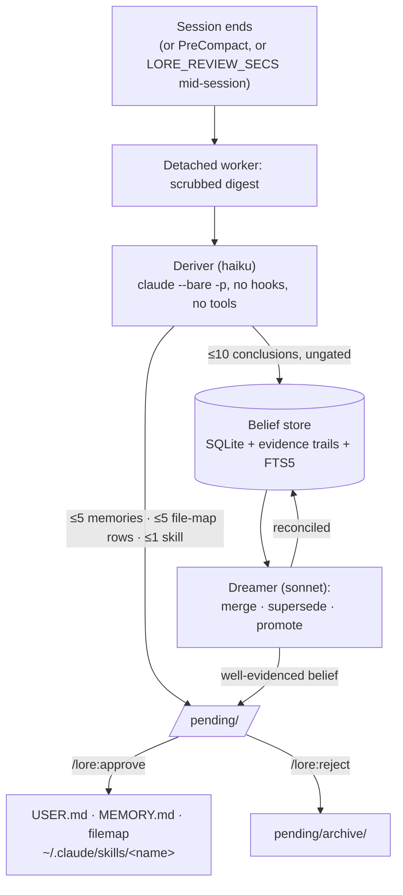
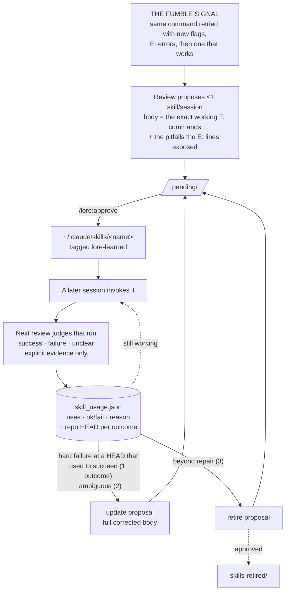
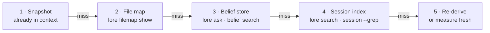

# Manual

Every command, config variable, and hook, plus how the stores and gates
mechanically fit together. This is *what* LORE does; for *why* specific
decisions were made, see [`user-model-channel-separation.md`](user-model-channel-separation.md),
[`memory-proposal-quality.md`](memory-proposal-quality.md), and
[`write-gate.md`](write-gate.md).

## Commands

| Command | What it does |
|---|---|
| `/lore:ask <question>` | Dialectic: a subagent gathers beliefs, curated memory and session hits, deepens into evidence trails and transcripts, returns a cited answer with a confidence grade. Follow-ups continue the same agent. |
| `/lore:remember <fact>` | Stores a fact now — picks the scope, condenses to one line, writes through the cap. |
| `/lore:context` | The exact entries in context right now, verbatim, as one table per scope. |
| `/lore:filemap [path "purpose"]` | No args prints the file map; args add or update a row. |
| `/lore:pending` | Lists staged proposals grouped by kind, each with its origin session and a keep/reject/merge judgment. Decides nothing. Clusters piles over ~50. |
| `/lore:approve <id\|all>` | Applies proposals: memory writes cap-enforced, skill updates diffed before overwriting, retires moved to `skills-retired/`. |
| `/lore:reject <id\|all>` | Archives proposals unapplied, verdict recorded in `pending/archive/`. |
| `/lore:review` | Reviews the current session now instead of waiting for session end. Runs as a TUI-visible background task. `--dry-run` prints the prompt and spends nothing. |
| `/lore:backfill [full\|project\|<path>]` | Pages a *whole* transcript through the deriver window by window, not just the newest window. Empty or `full` takes the current session, `project` every transcript of this project, or name a path. Reports the window count before spending. |
| `/lore:status` | Memory fill per scope, index and belief-store sizes, pending count, per-role models, learned skills with their records. |
| `/lore:motd` | Delta view: beliefs added in the last 24h/7d, newest claims verbatim, pending count. |
| `/lore:doctor` | Read-only diagnosis: environment, effective config, allowlist and auto-memory conflicts, unported entries, unreviewed backlog. Fixes nothing. |
| `/lore:setup` | Applies what doctor found, each change behind its own confirmation. |
| `/lore:config` | Prints the stage table and toggles stages by multi-select; writes `settings.json` → `"env"`. |
| `/lore:help` | One-screen reference card: commands plus the memory model. |

Everything runs as a plain CLI too — `python3 <plugin>/bin/lore.py --help`, stdlib only:

`inject` · `snapshot` · `memory` · `filemap` · `search` · `session` · `index` · `review` · `backfill` · `pending` · `approve` · `reject` · `belief` · `ask` · `outcome` · `audit` · `consult` · `stats` · `dream` · `crosscheck` · `status` · `motd` · `statusline` · `provenance` · `config` · `doctor` · `teardown` · `reset`

## Five stores

| Store | Location | Cap | Gate |
|---|---|---|---|
| User memory | `USER.md` | 4500 chars | write-time |
| Project memory | `MEMORY.md`, one per repo | 8800 chars | write-time |
| File map | `filemap/<slug>.md`, one per repo | 4400 chars | write-time |
| Belief store | `state.db` | none | read-time |
| Session index | `state.db` | none | local search only |

A project means the **git repo root**, so a session started in `repo/viz` shares the repo's memory instead of forking an invisible second scope.

- A project-scoped fact defaults to the repo it was learned in. When a session is clearly about a different repo (reviewing another repo's PR, discussing a plugin from its consumer), the reviewer can name that project explicitly; a resolvable name retargets the write and shows as a cross-project note in `/lore:pending`. An unresolvable name stays filed under the session's own project rather than guessing, flagged the same way.
- `lore memory move --scope project --match "<substring>" --to <slug>` relocates an already-mis-scoped entry, cap-enforced on the destination like any other write.

The snapshot injects at `SessionStart`, after `/clear` and compaction, and again whenever its content changes — `UserPromptSubmit` hashes it each prompt and re-sends only on a difference (`LORE_REFRESH_ON_CHANGE=0` opts out). It carries both memory scopes, a one-line file-map pointer, and the top user-model beliefs as a labeled interaction-model section.

## Session end → proposal → approval



The worker runs detached and interrupts nothing. A desktop notification follows, and the next session opens with the pending count. `/lore:pending` shows each proposal with a keep/reject/merge opinion the agent may state but never act on. Both verdicts leave a trail in `pending/archive/`.

## Skills earn their keep, then lose it

Memory records what happened. Skillification records *how it was done* — and keeps score.



Four rules keep the loop honest:

- **Only verified recipes.** The digest tags every tool call (`T:`) and tool error (`E:`), so review proposes a body built from commands that actually ran green. A plan nobody executed is not a recipe.
- **Runbooks, not one-liners.** Three steps or more, environment-specific flags, ordering constraints. A single-command fix becomes a memory line instead.
- **Silence is not an outcome.** A run counts as success or failure only when the digest shows the result — the user confirmed it, tests passed, an error traced. Abandonment records nothing, so the track record never fills with noise.
- **Drift ≠ rot.** Every outcome carries the repo HEAD it happened at. When a skill starts failing, a HEAD that moved between the successes and the failures says *the codebase changed*, not *the recipe is wrong* — and the gate reads that trail before it proposes anything.

`/lore:status` prints each learned skill with its record. Approve an `update` and the new body is diffed before overwriting; approve a `retire` and it moves to `skills-retired/` rather than vanishing.

## The belief gate sits on read, not on write

The deriver writes beliefs straight to SQLite, ungated. The gate sits on the read side instead:

- **World beliefs** — projects, systems, environment — reach the agent only on demand: `/lore:ask`, or `lore consult` at act time (opt in with `LORE_CONSULT=1`). Consult splits results into **STEER** (≥3 rows in the outcomes ledger, may shape the decision) and **CITE ONLY** (deriver-claimed — mention, never follow).
- **User-model beliefs** (`subject: user-model`) ride into the snapshot openly, labeled uncalibrated. They shape tone and approach, never authorize an action, and stamp `last_referenced` so the influence stays auditable.

**`user` and `user-model` are separate channels.** A preference the user stated goes to `user`, where a later session may act on it; a pattern the reviewer inferred from behaviour goes to `user-model`, which authorizes nothing. A conclusion already covered by the other channel is dropped before it is written. Rationale, the channel rule, and the containment check behind the drop logic: [`user-model-channel-separation.md`](user-model-channel-separation.md). `lore crosscheck` lists cross-channel near-duplicate pairs, read-only, for a human to resolve.

LORE measures confidence instead of asserting it: `lore stats` prints per-bucket empirical precision from the outcomes ledger, and shouts UNCALIBRATED below 100 outcomes.

**The cost, plainly.** A belief goes live the moment the deriver writes it; no human sees it first. Beliefs unreferenced for 45 days go dormant (`LORE_BELIEF_DORMANT_DAYS`; confidence ≥0.95 exempt) and two recorded contradictions retire one — but nothing re-verifies a claim that keeps getting cited. Read the store yourself now and then:

```sh
lore belief list                  # everything active, newest first
lore belief search "rebase"       # FTS over claims and evidence
lore belief show 42               # one belief, its evidence trail, its history
lore belief retract 42            # remove one that has gone stale
lore consult "deploy process"     # STEER if calibrated, else CITE ONLY
lore dream --dry-run              # what the reconciler would merge, spending nothing
lore crosscheck                   # user vs user-model near-duplicates, read-only
```

## The write gate: who is allowed to write directly

Curated memory and beliefs are injected straight into the model's context —
LORE's highest-trust surface. Every CLI write (`memory add|replace|remove|move`,
`belief add|retract`, `filemap add|replace|remove`) is classified by who is
calling. Rationale, the measured classification signals, and the gate's
limits: [`write-gate.md`](write-gate.md).

| Caller | How it is recognised | What happens |
|---|---|---|
| **interactive** — the agent's own Bash tool call | `AI_AGENT=claude-code_<v>_agent` | applies immediately (the intended path) |
| **terminal** — a human in a shell | no Claude Code in the env, stdin is a tty | applies immediately |
| **hook** — a command Claude Code ran as a hook | `AI_AGENT=..._harness`, or `CLAUDE_PROJECT_DIR` set without the agent marker | **stages in `pending/`** |
| **detached** — cron, a daemon, a script | no Claude Code, no tty | **stages in `pending/`** |

A staged write lands in the same `pending/` pile as every reviewer proposal —
applies with `/lore:approve`, archives unapplied with `/lore:reject`.
`/lore:pending` marks these rows with the context that wrote them.

**The gate is advisory** — forgeable via `AI_AGENT=..._agent` or
`LORE_WRITE_GATE=off` — and does not distinguish a skill or a subagent from
the interactive agent, since those carry the same marker. It stops writers
not actively trying to evade it: a plugin's hook, a third-party script, a
cron job.

**Provenance holds regardless.** Every entry records how it got in —
`approved`, `interactive`, `terminal`, `derived`, `dream`, or `unknown` for
anything that predates 0.36.0 — and the snapshot carries the counts per scope:

```
## Project memory (3120/8800 chars (35%)) — my-repo — provenance: 12 approved, 6 interactive, 9 unknown
```

`lore provenance` lists it per entry; beliefs show `via derived` /
`via approved` in `lore belief list|show`.

## Where the agent looks



The snapshot states this order as a rule: never re-measure what steps 2–4 already hold.

## Configuration

Every value below is optional and lives in `~/.claude/settings.json` → `"env"`, where hooks and commands both see it. `lore config set <VAR> <value>` and `lore config unset <VAR>` write that block for you (`LORE_*` only). Hook-read switches apply from a session's next hook fire; a restart refreshes everything.

| Variable | Default | Meaning |
|---|---|---|
| `LORE_ROOT` | `~/.claude/lore` | all state: memory files, `state.db`, pending, logs |
| `LORE_PROJECTS_DIR` | `~/.claude/projects` | where the indexer looks for transcripts |
| `LORE_USER_CAP` / `LORE_MEMORY_CAP` | 4500 / 8800 | curated memory caps, in chars |
| `LORE_FILEMAP_CAP` | 4400 | file-map cap, in chars (~55 rows) |
| `LORE_REVIEW_MODEL` | unset | umbrella override for both headless roles |
| `LORE_DERIVER_MODEL` | `haiku` | extraction — the easy role |
| `LORE_DREAMER_MODEL` | `sonnet` | belief reconciliation and promotions — the judgment-heavy role |
| `LORE_DIALECTIC_MODEL` | session default | model for the `/lore:ask` subagent |
| `LORE_REVIEW_MIN_MESSAGES` | 3 | skip review below this many user messages |
| `LORE_DIGEST_LAST_N` | 500 | newest messages considered for the digest |
| `LORE_DIGEST_TOTAL_CAP` | 250000 | chars kept for the whole digest |
| `LORE_MEMORY_PROPOSAL_CAP` | 3 | memory proposals one review may stage — the ceiling the prompt states *and* staging enforces |
| `LORE_DUP_CONTAINMENT` | 0.60 | drop a proposal whose tokens an existing entry in the same scope already carries by this fraction (a `replace` that matches a live entry is exempt) |
| `LORE_CLAUDE_BIN` | `which claude` | claude binary for the worker |
| `LORE_SKILLS_DIR` | `~/.claude/skills` | where approved skills install |
| `LORE_REFRESH_ON_CHANGE` | `1` | re-inject the snapshot the prompt after its content changes; `0` opts out |
| `LORE_REFRESH_SECS` | unset | optional periodic floor for that refresh (change-detection needs no setting) |
| `LORE_REVIEW_SECS` | unset | mid-session deriver: spawn a detached incremental review at most this often; unset = SessionEnd/PreCompact only |
| `LORE_BELIEF_DORMANT_DAYS` | 45 | beliefs unreferenced this long go dormant (confidence ≥0.95 exempt) |
| `LORE_INCLUDE_DORMANT` | unset | `1` puts dormant beliefs back in every evidence pack |
| `LORE_DEFER_DREAM` | unset | hold back per-review reconciliation; run `lore dream` once instead (set this for batches) |
| `LORE_MOTD` | `banner` | `banner` = wordmark, stats box and crab; `line` = one compact line; `0` = pending notice only (never suppressed) |
| `LORE_MOTD_COLOR` | auto | `1`/`0` forces color on or off; a captured hook stays plain automatically |
| `LORE_NOTIFY` | auto | desktop notification when proposals stage (`notify-send`); `0` disables |
| `LORE_NOTIFY_ICON` | `assets/logo.svg` | icon-theme name, or a path that exists |
| `LORE_AGENT_ID` | `main` | names the deriving agent; lands on proposals as `derived_by` and on every skill outcome |
| `LORE_SCOPE` | `all` | default tier for `snapshot`/`inject`: `user`, `project` or `all` |
| `LORE_STREAM_INDEX` | unset | `1` streams the growing transcript into the index every prompt |
| `LORE_CONSULT` | unset | `1` enables act-time `lore consult` |
| `LORE_DISABLE_INJECT` | unset | snapshot off; manual `lore snapshot`/`inject` keep working |
| `LORE_DISABLE_INDEX` | unset | indexing off; the existing index still serves search |
| `LORE_DISABLE_REVIEW` | unset | SessionEnd + PreCompact review off; explicit `lore review` still runs |
| `LORE_DISABLE_PRECOMPACT` | unset | PreCompact review off on its own; SessionEnd keeps running |
| `LORE_DISABLE_BELIEFS` | unset | belief store off; the deriver prompt drops the conclusions channel, `ask` serves memory + search |
| `LORE_DISABLE_SKILLS` | unset | skillification off; skill proposals drop unstaged with a log line |
| `LORE_WRITE_GATE` | `on` | `off` lets non-interactive callers write directly again (pre-0.36 behaviour). An escape hatch for your own automation — advisory, not a control: anything able to set it can equally forge the signals the gate reads |
| `LORE_SKIP` | unset | any value no-ops every hook — the master off-switch above all stage switches |

A disabled stage exits silently rather than failing, and drops its channel from the deriver prompt entirely — a model told about a channel will fill it.

## Hooks

| Event | Runs | Switch |
|---|---|---|
| `SessionStart` (startup, resume, clear, compact) | `lore inject` — the curated snapshot into context | `LORE_DISABLE_INJECT` |
| `UserPromptSubmit` | `lore refresh` — re-inject on content change, plus the mid-session deriver on `LORE_REVIEW_SECS`; `lore index --live` when `LORE_STREAM_INDEX=1` | `LORE_DISABLE_INJECT` / `LORE_DISABLE_INDEX` |
| `PreCompact` | `lore review` — derive before the summarizer drops the detail | `LORE_DISABLE_PRECOMPACT` (or `LORE_DISABLE_REVIEW`) |
| `SessionEnd` | `lore review` — the detached worker: digest, deriver, staged proposals, dreamer | `LORE_DISABLE_REVIEW` |

## `lore_core` as a library

The importable half of this repo installs like anything else, for a consumer that wants the memory model in its own process rather than in Claude Code:

```
uv add "lore-core @ git+https://github.com/docwilde/LORE@v0.35.1"
```

Only `lore_core/` is packaged — `bin/`, `hooks/`, `commands/` and `skills/` are plugin assets Claude Code loads by path, not library code. No runtime dependencies: stdlib-only is the promise this page makes, and the empty dependency list is now asserted by a test. No `lore` console script either, because the CLI belongs to the plugin and one machine should not have two of it.

`.claude-plugin/plugin.json` stays the one place the version is written. The build reads it, `lore_core.__version__` reads it, and an installed wheel — which carries no manifest — falls back to its own metadata, built from that same file.

**This changes nothing for plugin users.** `/plugin install lore` copies the same tree and runs the same `bin/lore.py`; nothing on the plugin path reads `pyproject.toml`.
